# BÁO CÁO BÀI TẬP LỚN
# HỌC PHẦN: PHÂN TÍCH VÀ THIẾT KẾ HỆ THỐNG

---

<br/>

### TRƯỜNG ĐẠI HỌC TÀI NGUYÊN VÀ MÔI TRƯỜNG HÀ NỘI
### KHOA CÔNG NGHỆ THÔNG TIN

<br/><br/>

# ĐỀ TÀI:
# PHÂN TÍCH VÀ THIẾT KẾ HỆ THỐNG QUẢN LÝ, ĐẶT SÂN THỂ THAO PICKLEBALL VÀ BÁN THIẾT BỊ TRỰC TUYẾN THEO HƯỚNG ĐỐI TƯỢNG VÀ KIẾN TRÚC PHÂN TẦNG (OOAD & LAYERED ARCHITECTURE)

<br/><br/>

* **Giảng viên hướng dẫn**: `[Điền tên Giảng viên hướng dẫn]`
* **Học phần**: Phân tích và thiết kế hệ thống
* **Lớp học phần**: `[Điền mã lớp học phần]`
* **Nhóm sinh viên thực hiện**: `[Điền số nhóm]`

| STT | Họ và tên sinh viên | Mã sinh viên | Nhiệm vụ phân công |
| :---: | :--- | :---: | :--- |
| 1 | `[Họ và tên SV 1]` | `[Mã SV 1]` | Trưởng nhóm - Khảo sát bài toán, Phân tích yêu cầu, Mô hình hóa Use Case |
| 2 | `[Họ và tên SV 2]` | `[Mã SV 2]` | Thiết kế kiến trúc tổng thể, Phân rã thành phần, Đánh giá ATAM |
| 3 | `[Họ và tên SV 3]` | `[Mã SV 3]` | Thiết kế dữ liệu (ERD) và Thiết kế lớp (Class Diagram, State Machine) |
| 4 | `[Họ và tên SV 4]` | `[Mã SV 4]` | Thiết kế giao diện (UI/UX, Sitemap) và Tương tác ngoại vi |
| 5 | `[Họ và tên SV 5]` | `[Mã SV 5]` | Thiết kế thành phần, Sơ đồ tuần tự (Sequence Diagram), Tổng hợp báo cáo |

<br/><br/>

**Hà Nội — Năm 2026**

---

\newpage

# LỜI CẢM ƠN

Lời đầu tiên, nhóm chúng em xin gửi lời cảm ơn chân thành và sâu sắc nhất tới Ban Giám hiệu Trường Đại học Tài nguyên và Môi trường Hà Nội cùng các thầy cô giáo trong Khoa Công nghệ Thông tin đã tạo điều kiện học tập tốt nhất, truyền đạt cho chúng em những nền tảng tri thức quý báu về kỹ thuật phần mềm trong suốt quá trình theo học.

Đặc biệt, nhóm chúng em xin bày tỏ lòng biết ơn sâu sắc tới **Thầy/Cô giảng viên phụ trách học phần Phân tích và thiết kế hệ thống**. Trong suốt quá trình học tập và hoàn thiện bài tập lớn, Thầy/Cô đã tận tình định hướng tư duy phân tích hướng đối tượng (OOAD), phương pháp mô hình hóa trực quan bằng ngôn ngữ UML, các nguyên lý kiến trúc phần mềm hiện đại và phương pháp đánh giá hệ thống khoa học. Những nhận xét và chỉ dẫn quý báu của Thầy/Cô là kim chỉ nam giúp chúng em hoàn thiện bản báo cáo này một cách chỉnh chu và logic nhất.

Mặc dù nhóm đã nỗ lực hết mình để vận dụng kiến thức lý thuyết vào giải quyết bài toán nghiệp vụ thực tiễn về quản lý, đặt sân thể thao Pickleball; tuy nhiên, do trình độ và kinh nghiệm thực tế còn hạn chế, bài báo cáo khó tránh khỏi những thiếu sót nhất định. Nhóm chúng em rất mong nhận được những góp ý, phê bình và chỉ dẫn từ Thầy/Cô để đề tài ngày càng được hoàn thiện hơn nữa.

*Chúng em xin chân thành cảm ơn!*

<br/>

*Hà Nội, ngày 02 tháng 10 năm 2026*  
**Tập thể Nhóm sinh viên thực hiện**

---

\newpage

# MỤC LỤC

* **LỜI MỞ ĐẦU**
  * 1. Lý do chọn đề tài
  * 2. Mục tiêu nghiên cứu
  * 3. Đối tượng và phạm vi nghiên cứu
  * 4. Phương pháp thực hiện
  * 5. Cấu trúc báo cáo
* **CHƯƠNG 1: TỔNG QUAN VỀ KIẾN TRÚC VÀ THIẾT KẾ PHẦN MỀM**
  * 1.1. Thiết kế phần mềm trong quy trình phát triển
    * 1.1.1. Một số khái niệm cốt lõi
    * 1.1.2. Chuyển đổi từ mô hình phân tích sang mô hình thiết kế
  * 1.2. Kiến trúc phần mềm
    * 1.2.1. Khái niệm kiến trúc phần mềm
    * 1.2.2. Kiến trúc và các thuộc tính chất lượng (Quality Attributes)
    * 1.2.3. Yêu cầu có ý nghĩa kiến trúc (Architecturally Significant Requirements - ASRs)
  * 1.3. Các nguyên lý thiết kế
    * 1.3.1. Trừu tượng hóa và che giấu thông tin (Abstraction & Information Hiding)
    * 1.3.2. Phân tách mối quan tâm và mô đun hóa (Separation of Concerns & Modularity)
    * 1.3.3. Tính gắn kết và tính ghép nối (High Cohesion & Low Coupling)
    * 1.3.4. Nguyên lý thiết kế hướng đối tượng SOLID
  * 1.4. Thể loại và phong cách kiến trúc
    * 1.4.1. Thể loại kiến trúc (Architectural Categories)
    * 1.4.2. Phong cách kiến trúc (Architectural Styles)
    * 1.4.3. So sánh thể loại và phong cách kiến trúc
  * 1.5. Mẫu thiết kế (Design Patterns & Architectural Patterns)
* **CHƯƠNG 2: PHÂN TÍCH YÊU CẦU HỆ THỐNG**
  * 2.1. Tổng quan bài toán
    * 2.1.1. Bối cảnh và hiện trạng vận hành sân thể thao Pickleball
    * 2.1.2. Vấn đề cần giải quyết và mục tiêu hệ thống
    * 2.1.3. Phạm vi hệ thống
  * 2.2. Yêu cầu chức năng
    * 2.2.1. Danh mục yêu cầu chức năng (Functional Requirements - FR)
    * 2.2.2. Sơ đồ Use Case tổng thể và theo phân hệ
    * 2.2.3. Đặc tả chi tiết các Use Case trọng tâm
  * 2.3. Mô hình hóa quy trình nghiệp vụ (Activity Diagrams)
    * 2.3.1. Quy trình Đặt sân và Giữ chỗ trực tuyến (Slot Hold Concurrency)
    * 2.3.2. Quy trình Thanh toán giỏ hàng hỗn hợp và Xử lý Webhook IPN
    * 2.3.3. Quy trình Bán hàng tại quầy POS và Check-in vé vào sân bằng mã QR
  * 2.4. Yêu cầu phi chức năng và ràng buộc
    * 2.4.1. Yêu cầu phi chức năng (Non-Functional Requirements - NFR)
    * 2.4.2. Các ràng buộc hệ thống
* **CHƯƠNG 3: THIẾT KẾ KIẾN TRÚC**
  * 3.1. Thể loại hệ thống và tiêu chí lựa chọn
  * 3.2. Lựa chọn phong cách kiến trúc
    * 3.2.1. So sánh các phương án kiến trúc theo tiêu chí kỹ thuật
    * 3.2.2. Quyết định lựa chọn kiến trúc phân lớp (Layered) và Headless Decoupled
    * 3.2.3. Quan hệ giữa phong cách kiến trúc, mẫu kiến trúc và mẫu thiết kế
  * 3.3. Kiến trúc tổng thể của hệ thống
    * 3.3.1. Sơ đồ kiến trúc tổng thể (Architecture Diagram)
    * 3.3.2. Trách nhiệm của từng tầng trong kiến trúc
    * 3.3.3. Quy tắc phụ thuộc và trao đổi dữ liệu giữa các tầng
  * 3.4. Phân rã hệ thống thành các thành phần
    * 3.4.1. Danh mục thành phần và trách nhiệm
    * 3.4.2. Sơ đồ phân rã thành phần (Subsystem Decomposition)
    * 3.4.3. Phụ thuộc giữa các thành phần (Component Dependency)
  * 3.5. Đánh giá kiến trúc
    * 3.5.1. Phương pháp đánh giá kiến trúc phần mềm ATAM
    * 3.5.2. Đánh giá theo các kịch bản chất lượng (Quality Attribute Scenarios)
    * 3.5.3. Điểm nhạy cảm, điểm đánh đổi và rủi ro kiến trúc
* **CHƯƠNG 4: THIẾT KẾ DỮ LIỆU VÀ LỚP**
  * 4.1. Thiết kế dữ liệu
    * 4.1.1. Thực thể và thuộc tính
    * 4.1.2. Mối quan hệ giữa các thực thể và ràng buộc toàn vẹn
    * 4.1.3. Sơ đồ thực thể quan hệ (ERD Diagram)
  * 4.2. Thiết kế lớp
    * 4.2.1. Xác định lớp và phân bổ trách nhiệm (BCE Pattern)
    * 4.2.2. Thuộc tính, phương thức và quan hệ giữa các lớp
    * 4.2.3. Sơ đồ lớp chi tiết (Class Diagram)
  * 4.3. Thiết kế hành vi của đối tượng (State Machine Diagrams)
    * 4.3.1. Sơ đồ trạng thái đối tượng Ca sân (TimeSlot)
    * 4.3.2. Sơ đồ trạng thái đối tượng Đơn hàng hỗn hợp (Order)
    * 4.3.3. Sơ đồ trạng thái đối tượng Phiên giữ chỗ tạm thời (SlotHold)
  * 4.4. Quan hệ giữa thiết kế lớp và thiết kế kiến trúc
* **CHƯƠNG 5: THIẾT KẾ GIAO DIỆN VÀ THÀNH PHẦN**
  * 5.1. Thiết kế giao diện
    * 5.1.1. Nguyên tắc thiết kế giao diện người dùng
    * 5.1.2. Đối tượng người dùng và cấu trúc điều hướng (Sitemap & Flow)
    * 5.1.3. Thiết kế màn hình trực quan (Wireframes & UI Mockups)
    * 5.1.4. Thiết kế giao diện kết nối với hệ thống bên ngoài
  * 5.2. Thiết kế thành phần
    * 5.2.1. Interface của các thành phần (Component Interfaces)
    * 5.2.2. Sơ đồ thành phần (Component Diagram)
    * 5.2.3. Thiết kế tương tác giữa các thành phần (Sequence Diagrams)
    * 5.2.4. Thiết kế chi tiết các thành phần trọng tâm
    * 5.2.5. Đánh giá theo tính gắn kết (Cohesion) và tính ghép nối (Coupling)
* **KẾT LUẬN VÀ KIẾN NGHỊ**
  * 1. Kết luận
  * 2. Hạn chế
  * 3. Kiến nghị và Hướng phát triển
* **TÀI LIỆU THAM KHẢO**

---

\newpage

# DANH MỤC THUẬT NGỮ VÀ CHỮ VIẾT TẮT

| Viết tắt | Từ gốc tiếng Anh | Diễn giải tiếng Việt |
| :--- | :--- | :--- |
| **OOAD** | Object-Oriented Analysis and Design | Phân tích và thiết kế hướng đối tượng |
| **UML** | Unified Modeling Language | Ngôn ngữ mô hình hóa thống nhất |
| **ASR** | Architecturally Significant Requirement | Yêu cầu có ý nghĩa kiến trúc |
| **ATAM** | Architecture Tradeoff Analysis Method | Phương pháp phân tích đánh đổi kiến trúc |
| **SoC** | Separation of Concerns | Nguyên lý phân tách mối quan tâm |
| **SOLID** | SRP, OCP, LSP, ISP, DIP | 5 nguyên lý thiết kế hướng đối tượng chuẩn mực |
| **ERD** | Entity-Relationship Diagram | Sơ đồ quan hệ thực thể |
| **BCE** | Boundary - Control - Entity | Mẫu phân loại lớp biên, điều khiển và thực thể |
| **DTO** | Data Transfer Object | Đối tượng vận chuyển dữ liệu giữa các tầng |
| **REST** | Representational State Transfer | Phong cách kiến trúc phần mềm định hướng tài nguyên |
| **SPA** | Single Page Application | Ứng dụng web đơn trang |
| **POS** | Point of Sale | Điểm bán hàng và phục vụ trực tiếp tại quầy |
| **IPN** | Instant Payment Notification | Thông báo trạng thái thanh toán tức thời qua Webhook |
| **HMAC** | Hash-based Message Authentication Code | Mã xác thực thông điệp dựa trên hàm băm mật mã |
| **RBAC** | Role-Based Access Control | Mô hình kiểm soát truy cập dựa trên vai trò |
| **JWT** | JSON Web Token | Chuỗi mã thông báo xác thực danh tính người dùng |
| **ZXing** | "Zebra Crossing" QR Engine | Thư viện xử lý và sinh mã vạch/mã QR đa định dạng |

---

\newpage

# DANH MỤC BẢNG BIỂU

* Bảng 1.1: So sánh giữa Thể loại kiến trúc và Phong cách kiến trúc
* Bảng 1.2: Bảng ánh xạ các nguyên lý SOLID vào hệ thống phần mềm
* Bảng 2.1: Danh mục yêu cầu chức năng hệ thống (Functional Requirements)
* Bảng 2.2: Bảng đặc tả Use Case UC01 - Đặt và tạm giữ chỗ ca sân trực tuyến
* Bảng 2.3: Bảng đặc tả Use Case UC02 - Thanh toán giỏ hàng hỗn hợp
* Bảng 2.4: Bảng đặc tả Use Case UC03 - Bán hàng tại quầy POS và tạo đơn kết hợp
* Bảng 2.5: Bảng đặc tả Use Case UC04 - Quét mã QR check-in vào sân
* Bảng 2.6: Danh mục yêu cầu phi chức năng hệ thống (Non-Functional Requirements)
* Bảng 3.1: So sánh các phương án kiến trúc phần mềm theo tiêu chí chất lượng
* Bảng 3.2: Danh mục các phân hệ thành phần và trách nhiệm xử lý
* Bảng 3.3: Bảng ma trận kịch bản đánh giá chất lượng kiến trúc theo ATAM
* Bảng 4.1: Bảng từ điển dữ liệu các thực thể cốt lõi trong hệ thống
* Bảng 4.2: Bảng ánh xạ giữa Mô hình Lớp (Class Model) và Mô hình Dữ liệu (Relational Model)
* Bảng 5.1: Danh mục Interface của các thành phần nghiệp vụ cốt lõi
* Bảng 5.2: Bảng đánh giá mức độ Gắn kết (Cohesion) và Ghép nối (Coupling) của các thành phần

---

\newpage

# DANH MỤC HÌNH ẢNH

* Hình 1.1: Quy trình chuyển đổi từ Mô hình Phân tích sang Mô hình Thiết kế
* Hình 2.1: Sơ đồ Use Case tổng thể toàn hệ thống PickleBallWeb
* Hình 2.2: Sơ đồ Use Case phân hệ Khách hàng (Customer Portal)
* Hình 2.3: Sơ đồ Use Case phân hệ Quản lý & Lễ tân (Admin & POS Portal)
* Hình 2.4: Sơ đồ hoạt động (Activity Diagram) Quy trình Đặt sân và Giữ chỗ 10 phút
* Hình 2.5: Sơ đồ hoạt động Quy trình Thanh toán đơn hàng kết hợp & Webhook MoMo
* Hình 2.6: Sơ đồ hoạt động Quy trình Bán hàng tại quầy POS & Quét mã QR Check-in
* Hình 3.1: Sơ đồ kiến trúc tổng thể hệ thống theo mô hình Headless Decoupled & Phân tầng
* Hình 3.2: Sơ đồ phân rã thành phần và mối quan hệ phụ thuộc (Subsystem Decomposition)
* Hình 4.1: Sơ đồ thực thể quan hệ (ERD - Entity Relationship Diagram)
* Hình 4.2: Sơ đồ lớp chi tiết (Class Diagram) theo mẫu BCE và Service Layer
* Hình 4.3: Sơ đồ trạng thái đối tượng Ca sân (TimeSlot State Machine)
* Hình 4.4: Sơ đồ trạng thái đối tượng Đơn hàng hỗn hợp (Order State Machine)
* Hình 4.5: Sơ đồ trạng thái đối tượng Phiên giữ chỗ tạm thời (SlotHold State Machine)
* Hình 5.1: Sơ đồ cấu trúc điều hướng người dùng (Sitemap & Navigation Flow)
* Hình 5.2: Sơ đồ thành phần hệ thống (Component Diagram)
* Hình 5.3: Sơ đồ tuần tự (Sequence Diagram) - Nghiệp vụ Khóa giữ chỗ 10 phút chống tranh chấp
* Hình 5.4: Sơ đồ tuần tự - Nghiệp vụ Thanh toán đơn hàng kết hợp nguyên tử (Atomic Saga)
* Hình 5.5: Sơ đồ tuần tự - Tiếp nhận và xác thực Webhook MoMo IPN chữ ký số HMAC

---

\newpage

# MỞ ĐẦU

### 1. Lý do chọn đề tài

Trong giai đoạn chuyển đổi số và xu hướng phát triển mạnh mẽ của phong trào thể dục thể thao hiện nay, **Pickleball** nổi lên như một bộ môn thể thao có tốc độ tăng trưởng nhanh nhất tại Việt Nam. Sự giao thoa tinh tế giữa bóng bàn, cầu lông và quần vợt giúp Pickleball tiếp cận được đông đảo các lứa tuổi, dẫn đến sự xuất hiện ồ ạt của các cụm sân thể thao và kéo theo nhu cầu mua sắm thiết bị chuyên dụng (vợt, bóng thi đấu, túi thể thao, phụ kiện bảo hộ).

Tuy nhiên, khảo sát thực tế tại các cụm sân thể thao cho thấy phần lớn quy trình vận hành hiện nay đang bộc lộ những hạn chế cố hữu:
1. **Quy trình đặt sân thủ công và phân tán**: Đa số sân bãi vẫn ghi nhận lịch qua tin nhắn mạng xã hội (Zalo, Facebook) hoặc gọi điện thoại. Cách làm này dẫn đến tình trạng quá tải vào khung giờ cao điểm (17h00 - 21h00), thường xuyên phát sinh lỗi **đặt trùng sân (double-booking)** và thiếu minh bạch về giá theo khung giờ (Peak/Off-peak).
2. **Thiếu cơ chế ràng buộc giữ chỗ thời gian thực**: Khách đặt lịch qua điện thoại nhưng không đặt cọc, dẫn đến tỷ lệ "bỏ sân ảo" (no-show) cao gây thất thoát doanh thu nghiêm trọng. Ngược lại, nếu yêu cầu chuyển khoản thủ công chụp biên lai, nhân viên phải đối soát tài khoản ngân hàng bằng mắt thường rất chậm chạp và dễ nhầm lẫn.
3. **Sự chia cắt giữa dịch vụ sân bãi và kinh doanh phụ kiện**: Người đến chơi thể thao luôn phát sinh nhu cầu thuê/mua vợt, bóng và nước giải khát. Nếu sử dụng các phần mềm bán hàng tạp hóa rời rạc, hóa đơn thuê sân và hóa đơn hàng hóa bị tách biệt, khiến việc quản lý doanh thu, kiểm soát tồn kho và xuất hóa đơn tổng hợp gặp nhiều trở ngại.
4. **Hạn chế của kiến trúc phần mềm truyền thống**: Các hệ thống quản lý sân bãi cũ thường được xây dựng theo kiểu nguyên khối (Monolithic), mã HTML nhúng lẫn mã nguồn xử lý phía máy chủ (Server-Side Rendering). Mỗi thao tác người dùng đều tải lại toàn trang (F5), gây lãng phí tài nguyên mạng, tốc độ phản hồi chậm và rất khó khăn khi muốn mở rộng giao diện sang thiết bị di động hay máy tính bảng tại quầy thu ngân.

Xuất phát từ thực tiễn trên, việc áp dụng phương pháp luận **Phân tích và Thiết kế Hệ thống Hướng đối tượng (OOAD)** cùng các nguyên lý kiến trúc phần mềm hiện đại nhằm xây dựng đề tài: **"Phân tích và thiết kế hệ thống quản lý, đặt sân thể thao Pickleball và bán thiết bị trực tuyến theo hướng đối tượng và kiến trúc phân tầng (OOAD & Layered Architecture)"** là hoàn toàn cấp thiết, mang tính ứng dụng thực tiễn cao và đáp ứng chuẩn mực học thuật của môn học.

---

### 2. Mục tiêu nghiên cứu

#### 2.1. Mục tiêu tổng quát
Vận dụng có hệ thống các nguyên lý, quy chuẩn lý thuyết của học phần **Phân tích và thiết kế hệ thống** (quy trình phát triển phần mềm, nguyên lý SOLID, mẫu thiết kế GoF, kiến trúc phân tầng, phân tích hướng đối tượng với UML) để xây dựng một bản thiết kế phần mềm hoàn chỉnh, khoa học và chặt chẽ cho hệ thống quản lý, đặt sân thể thao Pickleball và thương mại thiết bị thể thao.

#### 2.2. Mục tiêu cụ thể
1. **Về mặt Phân tích yêu cầu**:
   - Khảo sát thấu đáo quy trình nghiệp vụ thực tế tại các cụm sân thể thao, xác định chính xác các tác nhân (Actor) và ca sử dụng (Use Case).
   - Mô hình hóa chi tiết các quy trình nghiệp vụ bằng Sơ đồ Use Case và Sơ đồ Hoạt động (Activity Diagram).
   - Đặc tả chuẩn hóa các yêu cầu chức năng và yêu cầu phi chức năng (ASRs) làm cơ sở cho kiến trúc.
2. **Về mặt Thiết kế kiến trúc**:
   - So sánh, đánh giá và lựa chọn phong cách kiến trúc phù hợp (Kiến trúc phân tầng Layered kết hợp Headless Decoupled RESTful API).
   - Phân rã hệ thống thành các thành phần (Subsystems/Components) độc lập, có tính gắn kết cao (High Cohesion) và ghép nối lỏng (Low Coupling).
   - Đánh giá chất lượng kiến trúc bằng phương pháp ATAM dựa trên các kịch bản thực tế.
3. **Về mặt Thiết kế dữ liệu và lớp**:
   - Xây dựng mô hình thực thể liên kết (ERD) chuẩn hóa dữ liệu, đảm bảo tính toàn vẹn quan hệ.
   - Thiết kế sơ đồ lớp chi tiết (Class Diagram) theo mẫu phân loại Boundary - Control - Entity (BCE) và Service Layer.
   - Mô hình hóa hành vi thay đổi trạng thái của các đối tượng trọng tâm (TimeSlot, Order, SlotHold) qua Sơ đồ trạng thái (State Machine Diagram).
4. **Về mặt Thiết kế giao diện và thành phần**:
   - Thiết kế cấu trúc điều hướng giao diện (Sitemap & Navigation Flow) đáp ứng các nguyên tắc công thái học UI/UX.
   - Xây dựng sơ đồ thành phần (Component Diagram) và các sơ đồ tuần tự (Sequence Diagram) mô tả luồng tương tác thông điệp giữa các đối tượng để giải quyết triệt để các bài toán khó: Khóa giữ chỗ 10 phút chống trùng sân, Giao dịch nguyên tử giỏ hàng hỗn hợp, Tiếp nhận Webhook thanh toán IPN MoMo và Check-in vé điện tử bằng mã QR.

---

### 3. Đối tượng và phạm vi nghiên cứu

* **Đối tượng nghiên cứu**:
  * Lý thuyết về kỹ thuật phần mềm: Chu trình phát triển phần mềm, phương pháp phân tích thiết kế hướng đối tượng (OOAD), ngôn ngữ mô hình hóa UML 2.5.
  * Các phong cách kiến trúc phần mềm (Layered, Client-Server, Event-Driven, Headless RESTful) và các thuộc tính chất lượng phần mềm (ISO/IEC 25010).
  * Quy trình vận hành thực tế của mô hình sân thể thao kết hợp bán lẻ: Quản lý cụm sân, chia ca giờ vàng/giờ thường, cơ chế tạm giữ chỗ trực tuyến, giỏ hàng kết hợp, thanh toán điện tử và check-in vé.
* **Phạm vi hệ thống**:
  * Quản lý cụm 8 sân Pickleball tiêu chuẩn (`Sân A1, A2, B1, B2, C1, C2, D1, D2`) chia thành cụm sân ngoài trời và sân có mái che.
  * Khung giờ hoạt động từ 05:00 sáng đến 23:00 đêm (17 khung giờ 1 tiếng/ngày), áp dụng đơn giá linh hoạt theo giờ cao điểm (Peak: sau 17h00) và giờ thấp điểm (Off-peak).
  * Bán lẻ 42 sản phẩm thiết bị: Vợt Pickleball, bóng thi đấu, túi thể thao, phụ kiện; quản lý chi tiết theo từng biến thể (Size, Màu sắc, Tồn kho riêng).
  * Thanh toán đa phương thức: Cổng thanh toán MoMo (quét QR/App), chuyển khoản VietQR Napas247 và tiền mặt tại quầy.
  * Cung cấp 2 cổng giao tiếp chuyên biệt: Cổng khách hàng (Customer Portal) phục vụ người chơi và Cổng quản trị/Lễ tân (Admin & POS Portal) phục vụ nhân viên thu ngân và chủ sân.

---

### 4. Phương pháp thực hiện

1. **Phương pháp nghiên cứu lý thuyết**: Nghiên cứu các tài liệu học thuật về Phân tích & Thiết kế hệ thống, các giáo trình kỹ thuật phần mềm chuẩn mực (Ian Sommerville, Roger S. Pressman, Martin Fowler), các tài liệu tiêu chuẩn ISO/IEC 25010 và mẫu thiết kế Gang of Four (GoF).
2. **Phương pháp phân tích hướng đối tượng (OOAD)**: Sử dụng kỹ thuật ca sử dụng (Use Case Driven) để nắm bắt yêu cầu nghiệp vụ; phân tích tĩnh để xác định các lớp khái niệm và mối quan hệ; phân tích động để nắm bắt hành vi tương tác và chuyển trạng thái của đối tượng.
3. **Phương pháp mô hình hóa trực quan bằng UML**: Sử dụng bộ công cụ UML 2.5 (Mermaid) để biểu diễn trực quan: Use Case Diagram, Activity Diagram, Architecture Diagram, Class Diagram, State Machine Diagram, Component Diagram và Sequence Diagram.
4. **Phương pháp đánh giá kiến trúc**: Vận dụng phương pháp ATAM (Architecture Tradeoff Analysis Method) của Viện Kỹ nghệ Phần mềm SEI (Carnegie Mellon University) để đánh giá sự đánh đổi giữa hiệu năng, độ tin cậy và khả năng mở rộng của hệ thống.

---

### 5. Cấu trúc báo cáo

Bản báo cáo được tổ chức chặt chẽ thành 5 chương trọng tâm theo đúng đề cương hướng dẫn:
* **Mở đầu**: Giới thiệu lý do chọn đề tài, mục tiêu, đối tượng, phạm vi và phương pháp nghiên cứu.
* **Chương 1: Tổng quan về Kiến trúc và thiết kế phần mềm**: Trình bày hệ thống cơ sở lý thuyết vững chắc về quy trình thiết kế, các thuộc tính chất lượng, nguyên lý thiết kế trừu tượng hóa, mô đun hóa, SOLID, các thể loại/phong cách kiến trúc và mẫu thiết kế.
* **Chương 2: Phân tích yêu cầu hệ thống**: Khảo sát bài toán, danh mục yêu cầu chức năng, sơ đồ Use Case, đặc tả Use Case trọng tâm, mô hình hóa quy trình nghiệp vụ bằng Activity Diagram, yêu cầu phi chức năng và ràng buộc.
* **Chương 3: Thiết kế kiến trúc**: Lựa chọn thể loại, phong cách kiến trúc phân lớp, sơ đồ kiến trúc tổng thể, trách nhiệm các tầng, phân rã thành phần và đánh giá kiến trúc theo phương pháp ATAM.
* **Chương 4: Thiết kế dữ liệu và lớp**: Thiết kế cơ sở dữ liệu quan hệ (ERD), thiết kế lớp (Class Diagram) theo mẫu BCE, ánh xạ giữa mô hình lớp và dữ liệu, thiết kế sơ đồ trạng thái đối tượng (State Machine).
* **Chương 5: Thiết kế giao diện và thành phần**: Thiết kế giao diện công thái học (UI/UX, Sitemap), thiết kế thành phần (Component Diagram), thiết kế tương tác các thành phần qua sơ đồ tuần tự (Sequence Diagram), đánh giá tính gắn kết và ghép nối.
* **Kết luận và kiến nghị**: Đánh giá kết quả đạt được, chỉ ra các hạn chế và đề xuất hướng phát triển hệ thống trong tương lai.
* **Tài liệu tham khảo**: Liệt kê các giáo trình, sách chuyên khảo và tài liệu kỹ thuật đã sử dụng.

---

\newpage

# CHƯƠNG 1. TỔNG QUAN VỀ KIẾN TRÚC VÀ THIẾT KẾ PHẦN MỀM

## 1.1. Thiết kế phần mềm trong quy trình phát triển

### 1.1.1. Một số khái niệm cốt lõi
Trong kỹ nghệ phần mềm (Software Engineering), phát triển một hệ thống là quá trình chuyển dịch từ ý tưởng và nhu cầu của thế giới thực sang một sản phẩm phần mềm thực thi ổn định trên máy tính. Trong vòng đời phát triển phần mềm (SDLC), hai giai đoạn giữ vai trò nền tảng quyết định chất lượng hệ thống là **Phân tích (Analysis)** và **Thiết kế (Design)**:
* **Phân tích phần mềm (Software Analysis)**: Trả lời cho câu hỏi *"Hệ thống phải làm gì?" (What the system must do)*. Nhiệm vụ trọng tâm là thấu hiểu miền bài toán (Domain Problem), thu thập yêu cầu từ các bên liên quan (Stakeholders), xác định các ca sử dụng (Use Cases) và thiết lập mô hình khái niệm mà không phụ thuộc vào công nghệ triển khai cụ thể.
* **Thiết kế phần mềm (Software Design)**: Trả lời cho câu hỏi *"Hệ thống được xây dựng như thế nào?" (How the system will be built)*. Đây là giai đoạn trí tuệ chuyển hóa các yêu cầu phân tích thành bản thiết kế kỹ thuật chi tiết: xác định cấu trúc các thành phần, cấu trúc dữ liệu, giao diện kết nối, giải thuật và các mẫu thiết kế cụ thể để chuẩn bị cho giai đoạn cài đặt mã nguồn.

### 1.1.2. Chuyển đổi từ mô hình phân tích sang mô hình thiết kế
Quá trình chuyển đổi từ phân tích sang thiết kế không phải là sự nhảy vọt ngẫu nhiên mà là một tiến trình tiến hóa có phương pháp luận:

```
[Mô hình Phân tích (Analysis Model)]
  ├── Use Case Diagrams & Specifications  ───────► Thiết kế Giao diện & Thiết kế Ca sử dụng
  ├── Activity Diagrams (Quy trình)        ───────► Thiết kế Luồng tương tác & Sơ đồ Tuần tự (Sequence)
  └── Conceptual Domain Classes           ───────► Thiết kế Lớp chi tiết (Design Class Diagram)
                                                   & Thiết kế Cơ sở dữ liệu (ERD)
                                                          │
                                                          ▼
                                            [Mô hình Thiết kế (Design Model)]
                                              ├── Kiến trúc tổng thể (Architecture)
                                              ├── Phân rã thành phần (Component Subsystems)
                                              └── Đặc tả chi tiết Lớp, Phương thức, Dữ liệu
```
*Hình 1.1: Quy trình chuyển đổi từ Mô hình Phân tích sang Mô hình Thiết kế*

1. **Từ Use Case sang Thiết kế Kiến trúc và Tương tác**: Các ca sử dụng chức năng ở tầng phân tích được phân rã thành các kịch bản tương tác cụ thể giữa các đối tượng (biểu diễn qua Sơ đồ Tuần tự - Sequence Diagram), từ đó xác định các lớp Điều khiển (Controller) và lớp Dịch vụ (Service).
2. **Từ Lớp Miền khái niệm sang Sơ đồ Lớp thiết kế và CSDL**: Lớp thực thể khái niệm được bổ sung kiểu dữ liệu cụ thể, visibility (public/private/protected), các phương thức nghiệp vụ, các mẫu thiết kế (Design Patterns), đồng thời ánh xạ thành các bảng trong Cơ sở dữ liệu quan hệ (Relational Tables).

---

## 1.2. Kiến trúc phần mềm

### 1.2.1. Khái niệm kiến trúc phần mềm
Theo định nghĩa chuẩn của Viện Kỹ nghệ Phần mềm SEI (Software Engineering Institute) và chuẩn IEEE 1471 / ISO/IEC 42010:
> *"Kiến trúc phần mềm của một hệ thống là cấu trúc hoặc các cấu trúc của hệ thống đó, bao gồm các thành phần phần mềm (Software Elements), các thuộc tính nhìn thấy được từ bên ngoài của các thành phần đó (Externally Visible Properties), và các mối quan hệ qua lại giữa chúng (Relationships among them)."*

Kiến trúc phần mềm không đi sâu vào chi tiết của từng thuật toán bên trong hàm, mà đóng vai trò là bản thiết kế tổng thể cấp cao nhất (High-level Blueprint). Nó định hình bộ khung chịu lực của ngôi nhà phần mềm, xác định cách thức tổ chức các phân hệ và nguyên tắc mà các lập trình viên phải tuân thủ trong quá trình xây dựng.

### 1.2.2. Kiến trúc và các thuộc tính chất lượng (Quality Attributes)
Kiến trúc phần mềm không chỉ phục vụ việc thực thi các chức năng thông thường (Functional Requirements), mà yếu tố then chốt định hình kiến trúc chính là các **Thuộc tính chất lượng (Quality Attributes / Non-Functional Requirements)** theo chuẩn ISO/IEC 25010:
1. **Hiệu năng (Performance)**: Đo lường qua thời gian phản hồi (Latency/Response Time) và thông lượng xử lý (Throughput). Kiến trúc phải tối ưu hóa truy vấn CSDL và giảm thiểu việc chuyển tiếp dữ liệu thừa.
2. **Tính sẵn sàng và độ tin cậy (Availability & Reliability)**: Khả năng hệ thống duy trì hoạt động ổn định và tự phục hồi khi có sự cố. Thể hiện qua tỷ lệ thời gian hoạt động (uptime > 99.9%) và tính toàn vẹn của dữ liệu trong các giao dịch.
3. **Tính bảo mật (Security)**: Khả năng chống lại các truy cập trái phép, bảo vệ tính bí mật (Confidentiality), toàn vẹn (Integrity) và sẵn sàng (Availability) của dữ liệu thông qua xác thực (Authentication), phân quyền (Authorization) và chữ ký số.
4. **Khả năng mở rộng (Scalability)**: Khả năng hệ thống đáp ứng tải gia tăng đột biến (ví dụ: lượng khách truy cập đặt sân giờ cao điểm) mà không làm suy giảm hiệu năng nghiêm trọng.
5. **Khả năng bảo trì và tiến hóa (Modifiability & Maintainability)**: Mức độ dễ dàng khi sửa lỗi, nâng cấp tính năng mới hoặc thay thế một thành phần công nghệ mà không ảnh hưởng tiêu cực tới các thành phần khác.

### 1.2.3. Yêu cầu có ý nghĩa kiến trúc (Architecturally Significant Requirements - ASRs)
Không phải mọi yêu cầu đều tác động như nhau tới kiến trúc. **Yêu cầu có ý nghĩa kiến trúc (ASRs)** là tập hợp con các yêu cầu có tầm ảnh hưởng sâu rộng nhất tới việc định hình cấu trúc hệ thống:
* **ASR-1 (Tính đồng thời & Chống xung đột - Concurrency)**: Hai người dùng cùng bấm đặt một ca sân tại cùng một tích tắc thì hệ thống phải đảm bảo chỉ duy nhất một người đặt thành công, người kia nhận thông báo lỗi rõ ràng. Yêu cầu này bắt buộc kiến trúc phải có cơ chế khóa dữ liệu (Pessimistic Locking) và giao dịch nguyên tử (ACID Transaction).
* **ASR-2 (Đơn hàng hỗn hợp nguyên tử - Atomic Mixed Checkout)**: Khách hàng mua cả dịch vụ thuê sân và hàng hóa phụ kiện trong cùng một đơn hàng. Nếu bước trừ kho hàng hóa thành công nhưng bước khóa ca sân thất bại (do đã bị người khác giữ), toàn bộ giao dịch phải tự động rollback, không được sinh ra đơn hàng "nửa vời".
* **ASR-3 (Bảo mật Webhook thanh toán - Idempotent Webhook)**: Cổng thanh toán MoMo gửi thông báo trạng thái IPN qua Internet. Kiến trúc phải xác thực chữ ký mật mã HMAC-SHA256 để chống giả mạo gói tin và xử lý Idempotency để nếu MoMo gửi lặp lại 2 lần một thông báo, hệ thống không bị cộng tiền hay duyệt đơn hai lần.

---

## 1.3. Các nguyên lý thiết kế

### 1.3.1. Trừu tượng hóa và che giấu thông tin
* **Trừu tượng hóa (Abstraction)**: Là kỹ thuật tập trung vào các đặc tính cốt lõi của một thực thể mà bỏ qua các chi tiết cài đặt phức tạp không cần thiết ở mức nhìn hiện tại. Ví dụ: Tầng Client chỉ cần biết Interface gọi API `holdSlot(slotId)` để giữ sân mà không cần quan tâm câu lệnh SQL bên dưới máy chủ thực hiện khóa bi quan như thế nào.
* **Che giấu thông tin (Information Hiding)**: Được đề xuất bởi David Parnas (1972), nguyên lý này quy định rằng mỗi mô-đun phần mềm chỉ nên công khai giao diện giao tiếp (Interface), còn toàn bộ cấu trúc dữ liệu nội bộ và thuật toán chi tiết phải được ẩn giấu (Encapsulation). Khi thuật toán nội bộ thay đổi, các mô-đun bên ngoài không bị ảnh hưởng.

### 1.3.2. Phân tách mối quan tâm và mô đun hóa
* **Phân tách mối quan tâm (Separation of Concerns - SoC)**: Hệ thống phần mềm phức tạp phải được chia thành các phần riêng biệt, mỗi phần chịu trách nhiệm giải quyết một mối bận tâm nghiệp vụ cụ thể. Việc hiển thị giao diện không được trộn lẫn với việc tính toán logic nghiệp vụ, và logic nghiệp vụ không được trộn lẫn với câu lệnh truy vấn CSDL.
* **Mô đun hóa (Modularity)**: Phân chia hệ thống thành các mô-đun độc lập có ranh giới rõ ràng. Một hệ thống mô đun hóa tốt cho phép các nhóm lập trình viên làm việc song song, kiểm thử độc lập và tái sử dụng linh hoạt.

### 1.3.3. Tính gắn kết và tính ghép nối
Hai thước đo kinh điển trong thiết kế phần mềm để đánh giá chất lượng mô đun hóa là:
* **Tính gắn kết (Cohesion)**: Thể hiện mức độ liên quan chặt chẽ giữa các trách nhiệm bên trong cùng một mô-đun. Thiết kế tốt hướng tới **Tính gắn kết cao (High Cohesion)** — một lớp hoặc một phân hệ chỉ nên thực hiện một tập hợp các nhiệm vụ có mối liên hệ mật thiết với nhau (ví dụ: `BookingService` chỉ chuyên trách xử lý nghiệp vụ ca sân và giữ chỗ, không ôm đồm việc gửi email hay xử lý giỏ hàng).
* **Tính ghép nối (Coupling)**: Thể hiện mức độ phụ thuộc lẫn nhau giữa các mô-đun khác nhau. Thiết kế tốt hướng tới **Tính ghép nối lỏng (Low/Loose Coupling)** — sự thay đổi bên trong mô-đun này không kéo theo sự đổ vỡ hàng loạt ở các mô-đun khác. Các thành phần giao tiếp với nhau qua các Interface trừu tượng hoặc Data Transfer Object (DTO).

### 1.3.4. Nguyên lý thiết kế hướng đối tượng SOLID
5 nguyên lý thiết kế hướng đối tượng của Robert C. Martin (Uncle Bob) là kim chỉ nam cho thiết kế lớp:
1. **S - Single Responsibility Principle (Đơn trách nhiệm)**: Mỗi lớp chỉ nên có một lý do duy nhất để thay đổi. Ví dụ: `TimeSlot` chỉ đóng vai trò chứa dữ liệu thực thể ca sân, việc tính toán giá giờ cao điểm do Service đảm nhận, việc truy vấn CSDL do Repository đảm nhận.
2. **O - Open/Closed Principle (Đóng/Mở)**: Một thực thể phần mềm phải mở cho việc mở rộng (Extension) nhưng đóng cho việc sửa đổi (Modification). Khi bổ sung phương thức thanh toán mới (ví dụ: thêm VNPay bên cạnh MoMo và VietQR), hệ thống chỉ cần thêm một lớp cài đặt mới thực thi `PaymentGateway` interface mà không phải sửa mã nguồn của `OrderService`.
3. **L - Liskov Substitution Principle (Thay thế Liskov)**: Các đối tượng của lớp con phải có thể thay thế được các đối tượng của lớp cha mà không làm thay đổi tính đúng đắn của chương trình.
4. **I - Interface Segregation Principle (Phân tách giao diện)**: Khách hàng không nên bị ép buộc phải phụ thuộc vào các interface mà họ không sử dụng. Thay vì tạo một giao diện khổng lồ "Fat Interface", nên chia nhỏ thành các interface chuyên biệt (ví dụ: tách riêng `ICourtAvailabilityReader` cho khách xem và `ICourtMaintenanceManager` cho lễ tân khóa sân).
5. **D - Dependency Inversion Principle (Đảo ngược phụ thuộc)**: Các mô-đun cấp cao không nên phụ thuộc vào các mô-đun cấp thấp; cả hai nên phụ thuộc vào sự trừu tượng hóa (Abstractions/Interfaces). Controller không phụ thuộc trực tiếp vào triển khai cụ thể của Database mà phụ thuộc vào `BookingService` interface.

---

## 1.4. Thể loại và phong cách kiến trúc

### 1.4.1. Thể loại kiến trúc (Architectural Categories)
Thể loại kiến trúc phân loại hệ thống dựa trên đặc tính hoạt động và bản chất xử lý của bài toán:
* **Hệ thống tương tác (Interactive Systems)**: Nhấn mạnh vào sự tương tác qua lại liên tục giữa người dùng và máy tính qua giao diện trực quan (UI/UX), yêu cầu phản hồi nhanh tức thì.
* **Hệ thống xử lý giao dịch (Transaction Processing Systems - TPS)**: Tập trung vào việc xử lý các giao dịch kinh doanh lớn, đảm bảo tính nhất quán dữ liệu ACID (Nguyên tử, Nhất quán, Cô lập, Bền vững).
* **Hệ thống phân tán (Distributed Systems)**: Các thành phần của hệ thống nằm trên nhiều nút mạng vật lý khác nhau (máy chủ đám mây, trình duyệt máy khách, cổng thanh toán ngân hàng) và phối hợp với nhau qua mạng truyền thông.

### 1.4.2. Phong cách kiến trúc (Architectural Styles)
Phong cách kiến trúc là một tập hợp các quy tắc định hình cấu trúc của hệ thống, bao gồm các loại thành phần, các cơ chế kết nối và các ràng buộc về cách chúng tương tác:
* **Kiến trúc phân tầng (Layered Architecture)**: Hệ thống được tổ chức thành các tầng phân cấp theo chiều dọc (Presentation Layer, Business Logic Layer, Data Access Layer, Database Layer). Mỗi tầng chỉ tương tác với tầng liền kề bên dưới nó.
* **Kiến trúc Khách - Chủ tách rời (Client-Server / Headless Decoupled REST)**: Phân tách hoàn toàn giữa giao diện người dùng (Client SPA) và máy chủ logic (Server API). Giao tiếp với nhau phi trạng thái (Stateless) thông qua giao thức chuẩn HTTP và định dạng JSON.
* **Kiến trúc Vi dịch vụ (Microservices Architecture)**: Chia nhỏ ứng dụng thành nhiều dịch vụ độc lập, mỗi dịch vụ chạy tiến trình riêng và có cơ sở dữ liệu riêng, giao tiếp qua HTTP/gRPC hoặc Message Broker.
* **Kiến trúc Hướng sự kiện (Event-Driven Architecture)**: Các thành phần giao tiếp bất đồng bộ thông qua việc phát và tiêu thụ các sự kiện (Events).

### 1.4.3. So sánh thể loại và phong cách kiến trúc

| Tiêu chí | Thể loại kiến trúc (Architectural Categories) | Phong cách kiến trúc (Architectural Styles) |
| :--- | :--- | :--- |
| **Bản chất** | Phân loại theo **đặc trưng bài toán & mục đích hoạt động** của phần mềm | Định hình **cách thức tổ chức cấu trúc & giải pháp kỹ thuật** |
| **Câu hỏi trả lời** | Phần mềm thuộc dạng ứng dụng gì? (Tương tác, Xử lý giao dịch hay Nhúng?) | Các thành phần được sắp xếp và kết nối với nhau như thế nào? |
| **Tính cố định** | Thường gắn liền với yêu cầu nghiệp vụ của miền bài toán | Kiến trúc sư có quyền lựa chọn và kết hợp nhiều phong cách khác nhau |
| **Áp dụng vào đề tài** | Đề tài là sự kết hợp giữa **Interactive System** (Giao diện đặt sân tương tác) và **Transaction Processing System** (Xử lý đơn hàng, thanh toán) | Đề tài áp dụng **Layered Architecture** ở Backend kết hợp **Headless Client-Server (REST API & Dual React SPA)** |

*Bảng 1.1: So sánh giữa Thể loại kiến trúc và Phong cách kiến trúc*

---

## 1.5. Mẫu thiết kế (Design Patterns & Architectural Patterns)

Mẫu thiết kế là các giải pháp đã được đúc kết, tối ưu hóa để giải quyết các vấn đề phổ biến phát sinh lặp đi lặp lại trong quá trình thiết kế phần mềm:
1. **Mẫu kiến trúc (Architectural Patterns)**:
   - **Mẫu Phân tầng (Layered Pattern)**: Tách biệt rõ ràng tầng Điều phối (Controller), tầng Dịch vụ (Service) và tầng Truy xuất dữ liệu (Repository).
   - **Mẫu Headless SPA**: Client chạy hoàn toàn trên trình duyệt, chỉ gọi lấy dữ liệu thô dạng JSON từ Server, giúp Server không phải tốn tài nguyên render HTML.
2. **Mẫu thiết kế Gang of Four (GoF Patterns)**:
   - **Repository Pattern**: Đóng gói logic truy xuất dữ liệu, cung cấp giao diện tập hợp đối tượng trừu tượng giúp Service không cần viết câu lệnh SQL thuần.
   - **Data Transfer Object (DTO) Pattern**: Đóng gói dữ liệu truyền tải giữa Client và Server, ngăn chặn việc để lộ cấu trúc bảng CSDL nội bộ ra bên ngoài và giảm thiểu số lượng lời gọi mạng.
   - **Singleton Pattern**: Đảm bảo một lớp chỉ có một thể hiện duy nhất trong suốt vòng đời ứng dụng (ví dụ: Token Provider, Database Connection Pool).
   - **Strategy Pattern**: Cho phép hoán đổi linh hoạt thuật toán tính phí vận chuyển hoặc cổng thanh toán tại thời điểm chạy (Runtime).
   - **Pessimistic Offline Lock Pattern**: Khóa tài nguyên ca sân ở mức bản ghi dữ liệu (`SELECT ... FOR UPDATE` / `@Lock(PESSIMISTIC_WRITE)`) để ngăn ngừa tuyệt đối race-condition trong môi trường đa luồng phân tán.


---

\newpage

# CHƯƠNG 2. PHÂN TÍCH YÊU CẦU HỆ THỐNG

## 2.1. Tổng quan bài toán

### 2.1.1. Bối cảnh và hiện trạng vận hành sân thể thao Pickleball
Trong những năm gần đây, phong trào tập luyện và thi đấu Pickleball tại Việt Nam phát triển với tốc độ bùng nổ, kéo theo sự ra đời của hàng loạt cụm sân phức hợp kết hợp dịch vụ thể thao. Tuy nhiên, việc vận hành tại các cơ sở này hiện nay phần lớn vẫn dựa vào các phương thức thủ công hoặc bán tự động:
* **Ghi nhận lịch sân phân tán**: Khách hàng liên hệ qua điện thoại, ứng dụng nhắn tin cá nhân (Zalo, Messenger) hoặc đến trực tiếp tại quầy. Lễ tân ghi chép vào sổ tay hoặc bảng tính Google Sheets chia sẻ chung. Vào các khung giờ cao điểm (17h00 – 21h00 các ngày trong tuần và trọn vẹn hai ngày cuối tuần), việc nhiều nhân viên cùng mở bảng tính để nhận lịch dẫn đến tình trạng ghi đè dữ liệu, gây ra lỗi **đặt trùng sân (double-booking)**.
* **Tỷ lệ hủy sân và bỏ sân ảo (No-show)**: Do không có cơ chế đặt cọc hoặc thanh toán trực tuyến gắn liền với phiên giữ chỗ thời gian thực, nhiều khách hàng đặt sân trước nhưng không đến, khiến sân bị trống trong khi khách có nhu cầu thực sự lại bị từ chối. Ngược lại, nếu yêu cầu khách chuyển khoản ngân hàng thủ công rồi gửi ảnh chụp màn hình biên lai, nhân viên mất nhiều thời gian kiểm tra đối soát, dễ nhầm lẫn hoặc bỏ sót.
* **Phân mảnh giữa dịch vụ sân bãi và bán lẻ thiết bị**: Người chơi Pickleball thường xuyên phát sinh nhu cầu mua vợt thi đấu, bóng tập, quấn cán, túi đựng và đồ uống giải khát ngay tại sân. Đa phần các cơ sở phải sử dụng hai hệ thống tách biệt: một file theo dõi lịch sân và một phần mềm bán hàng tạp hóa rời rạc. Điều này khiến khách hàng phải thanh toán nhiều lần, kế toán gặp khó khăn khi tổng hợp doanh thu và không nắm bắt được bức tranh tổng thể về chỉ số khai thác sân.

### 2.1.2. Vấn đề cần giải quyết và mục tiêu hệ thống
Nhằm giải quyết triệt để các tồn tại trên, hệ thống phần mềm mới cần đáp ứng các mục tiêu trọng tâm sau:
1. **Tự động hóa toàn bộ quy trình đặt sân theo thời gian thực**: Cung cấp giao diện trực quan cho phép khách hàng tra cứu tình trạng sân trống theo ngày, theo khung giờ và lựa chọn sân mong muốn.
2. **Cơ chế giữ chỗ tạm thời (Slot Hold Mechanism)**: Áp dụng khóa tạm thời (Hold) trong thời gian quy định (10 phút) ngay khi khách chọn sân để khách hoàn tất thanh toán. Trong 10 phút này, hệ thống bảo vệ ca sân không cho bất kỳ ai khác can thiệp. Nếu quá thời gian mà chưa thanh toán, hệ thống tự động giải phóng ca sân về trạng thái sẵn sàng (`available`).
3. **Giỏ hàng hỗn hợp và thanh toán nguyên tử (Atomic Mixed Cart)**: Cho phép khách hàng thêm đồng thời cả ca đặt sân và các sản phẩm phụ kiện thể thao (quản lý chi tiết theo biến thể SKU) vào cùng một giỏ hàng và thanh toán duy nhất một lần. Đảm bảo toàn vẹn dữ liệu: hoặc toàn bộ đơn hàng thành công (trừ kho và chuyển trạng thái sân sang `booked`), hoặc tự động hủy/rollback nếu có sự cố xảy ra.
4. **Hỗ trợ bán hàng tại quầy (POS) và Check-in vé điện tử bằng mã QR**: Trang bị cho nhân viên lễ tân giao diện bán hàng nhanh (POS) hỗ trợ tạo đơn trực tiếp, thanh toán tiền mặt/chuyển khoản, đồng thời tích hợp chức năng quét mã QR trên vé điện tử của khách hàng để thực hiện check-in vào sân nhanh chóng trong vòng dưới 2 giây.

### 2.1.3. Phạm vi hệ thống
* **Quy mô cơ sở vật chất**: Hệ thống quản lý cụm 8 sân Pickleball tiêu chuẩn quốc tế (`Sân A1, A2, B1, B2, C1, C2, D1, D2`), phân bố thành khu vực sân ngoài trời (Outdoor) và sân trong nhà có mái che (Indoor).
* **Thời gian hoạt động**: Mở cửa liên tục từ 05:00 sáng đến 23:00 đêm hàng ngày, chia thành 17 ca sân cố định (mỗi ca có thời lượng 60 phút). Bảng giá được thiết lập linh hoạt theo khung giờ thường (Off-peak: 05:00 – 17:00) và khung giờ vàng (Peak: 17:00 – 23:00).
* **Danh mục thương mại**: Quản lý 42 sản phẩm thiết bị thể thao Pickleball chuyên dụng (vợt, bóng, túi, phụ kiện thể thao), hỗ trợ theo dõi tồn kho độc lập theo từng biến thể (Product Variant: Size, Color).
* **Đối tượng phục vụ**: Phục vụ hai nhóm tác nhân chính thông qua hai giao diện Web SPA độc lập: Khách hàng (Customer Portal) và Cán bộ quản lý/Lễ tân (Admin & POS Portal).

---

## 2.2. Yêu cầu chức năng

### 2.2.1. Danh mục yêu cầu chức năng (Functional Requirements - FR)

| Mã FR | Tên yêu cầu chức năng | Tác nhân chính | Mô tả tóm tắt nghiệp vụ |
| :---: | :--- | :--- | :--- |
| **FR01** | Đăng ký & Đăng nhập | Khách hàng, Nhân viên | Khách hàng đăng ký tài khoản bằng Email/Số điện thoại. Đăng nhập hệ thống bằng mật khẩu bảo mật mã hóa BCrypt, cấp phát Bearer Token để truy cập. |
| **FR02** | Xem lịch sân & Tình trạng ca | Khách hàng, Nhân viên | Hiển thị ma trận 8 sân x 17 ca giờ theo ngày được chọn; trực quan hóa trạng thái từng ca: Sẵn sàng (`available`), Đang giữ chỗ (`held`), Đã đặt (`booked`), Đang sử dụng (`in_use`), Tạm khóa bảo trì (`locked`). |
| **FR03** | Tạm giữ ca sân (Hold Slot) | Khách hàng, Nhân viên | Khóa tạm thời ca sân đã chọn trong thời hạn chính xác 10 phút để người dùng chuyển tới bước thanh toán. Áp dụng cơ chế khóa bi quan chống xung đột đồng thời. |
| **FR04** | Duyệt danh mục & Tìm kiếm sản phẩm | Khách hàng | Khách hàng tra cứu 42 sản phẩm theo danh mục (Vợt, Bóng, Túi, Phụ kiện), tìm kiếm theo tên, xem hình ảnh thực tế và tồn kho theo từng biến thể. |
| **FR05** | Quản lý Giỏ hàng hỗn hợp | Khách hàng | Cho phép lưu trữ và cập nhật số lượng hàng hóa phụ kiện cùng với phiên giữ chỗ ca sân; tự động tính tổng tiền tạm tính, phí giao hàng và thời gian hết hạn của giỏ. |
| **FR06** | Áp dụng Mã giảm giá (Voucher) | Khách hàng, Nhân viên | Nhập mã voucher khuyến mãi; hệ thống kiểm tra điều kiện áp dụng (giá trị đơn tối thiểu, hạn sử dụng, số lượt dùng còn lại) và khấu trừ vào tổng tiền thanh toán. |
| **FR07** | Đặt hàng & Thanh toán trực tuyến | Khách hàng | Tạo đơn hàng chính thức từ giỏ hàng. Hỗ trợ thanh toán qua Cổng thanh toán MoMo (quét mã QR / App deeplink) và chuyển khoản ngân hàng VietQR Napas247. |
| **FR08** | Tiếp nhận Webhook thanh toán IPN | Cổng MoMo (Hệ thống ngoài) | Nhận thông báo kết quả giao dịch bất đồng bộ từ MoMo; xác thực chữ ký số HMAC-SHA256; chuyển trạng thái đơn hàng sang `PAID` và ca sân sang `booked`. |
| **FR09** | Bán hàng trực tiếp tại quầy (POS) | Lễ tân (Staff) | Giao diện thu ngân hỗ trợ chọn nhanh sân, chọn sản phẩm từ danh mục, thanh toán tiền mặt tại quầy và in/xuất hóa đơn ngay lập tức. |
| **FR10** | Quét mã QR Check-in vào sân | Lễ tân (Staff) | Sử dụng thiết bị quét mã hoặc Camera máy tính bảng để đọc mã QR trên vé điện tử của khách hàng; hệ thống xác thực tính hợp lệ và chuyển trạng thái sân sang `in_use`. |
| **FR11** | Quản lý Danh mục & Tồn kho | Quản trị viên (Admin) | Thêm, sửa, cập nhật thông tin sân bãi, ca sân, sản phẩm và biến thể; theo dõi biến động số lượng tồn kho theo thời gian thực. |
| **FR12** | Báo cáo Thống kê & Doanh thu | Quản trị viên (Admin) | Cung cấp biểu đồ và báo cáo chi tiết về doanh thu theo ngày/tháng/năm, cơ cấu doanh thu (tiền thuê sân vs tiền bán hàng), tỷ lệ lấp đầy sân (Court Utilization Rate). |

*Bảng 2.1: Danh mục yêu cầu chức năng hệ thống (Functional Requirements)*

---

### 2.2.2. Sơ đồ Use Case tổng thể và theo phân hệ

#### a) Sơ đồ Use Case tổng thể toàn hệ thống
Hệ thống PickleBallWeb bao gồm ba tác nhân chính:
* **Khách hàng (Customer)**: Người chơi có nhu cầu đặt sân và mua sắm thiết bị trực tuyến.
* **Lễ tân / Nhân viên thu ngân (Staff)**: Người trực tiếp vận hành cơ sở vật chất tại quầy, phục vụ check-in và thanh toán trực tiếp.
* **Quản trị viên (Admin)**: Người quản lý toàn diện hệ thống, cấu hình giá, quản lý kho hàng và theo dõi báo cáo tài chính.
* **Cổng thanh toán MoMo**: Hệ thống thanh toán ngoại vi tương tác qua giao thức Webhook IPN.

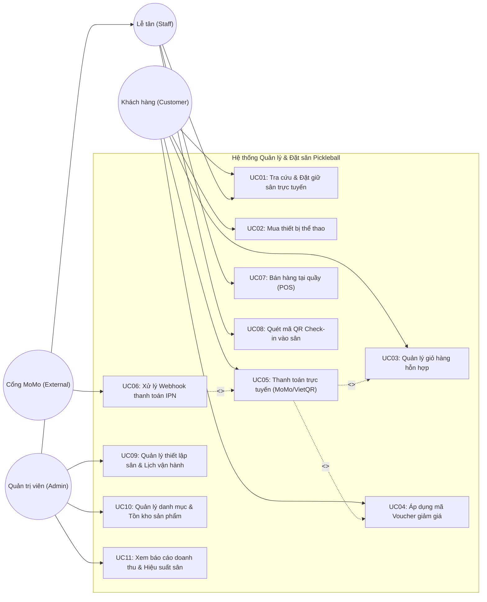
*Hình 2.1: Sơ đồ Use Case tổng thể toàn hệ thống PickleBallWeb*

---

#### b) Sơ đồ Use Case phân hệ Khách hàng (Customer Portal)
Phân hệ Khách hàng tập trung vào trải nghiệm đặt chỗ mượt mà, tiện lợi và hỗ trợ giỏ hàng đa năng kết hợp:

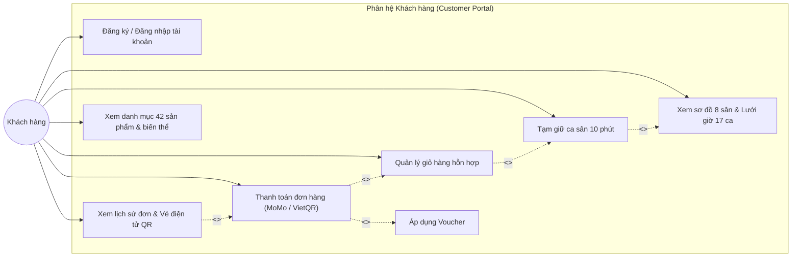
*Hình 2.2: Sơ đồ Use Case phân hệ Khách hàng (Customer Portal)*

---

#### c) Sơ đồ Use Case phân hệ Quản lý & Lễ tân (Admin & POS Portal)
Phân hệ phục vụ công tác điều hành tại cụm sân, bao gồm các ca sử dụng bán hàng tốc độ cao, xác thực vé và quản trị vận hành:

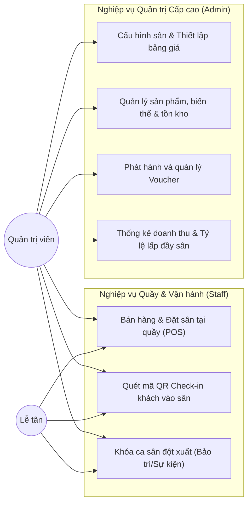
*Hình 2.3: Sơ đồ Use Case phân hệ Quản lý & Lễ tân (Admin & POS Portal)*

---

### 2.2.3. Đặc tả chi tiết các Use Case trọng tâm

#### a) Đặc tả Use Case UC01: Đặt và tạm giữ chỗ ca sân trực tuyến (Hold Slot)

| Thuộc tính Use Case | Nội dung đặc tả chi tiết |
| :--- | :--- |
| **Mã Use Case** | **UC01** |
| **Tên Use Case** | **Đặt và tạm giữ chỗ ca sân trực tuyến (Hold Slot 10 Minutes)** |
| **Tác nhân (Actor)** | Khách hàng (Customer), Lễ tân (Staff) |
| **Mục đích** | Cho phép người dùng khóa giữ độc quyền một ca sân cụ thể trong thời gian 10 phút để chuẩn bị tiến hành thanh toán, ngăn chặn hoàn toàn việc người khác đặt trùng. |
| **Điều kiện tiên quyết (Pre-conditions)** | 1. Người dùng đã đăng nhập vào hệ thống hoặc có phiên làm việc hợp lệ.<br/>2. Ca sân được chọn đang ở trạng thái sẵn sàng (`status = 'available'`).<br/>3. Thời điểm đặt sân phải thỏa mãn quy tắc giới hạn trước giờ chơi (Cut-off Time $\ge$ 30 phút). |
| **Điều kiện sau (Post-conditions)** | 1. Ca sân chuyển sang trạng thái tạm giữ (`status = 'held'`).<br/>2. Bản ghi giữ chỗ `SlotHold` được khởi tạo với mã token ngẫu nhiên và `expiresAt = Now + 10 phút`.<br/>3. Phiên giữ chỗ được gán vào giỏ hàng của người dùng. |
| **Luồng sự kiện chính (Main Flow)** | 1. Người dùng chọn ngày chơi và xem sơ đồ lưới 8 sân x 17 ca giờ.<br/>2. Người dùng nhấn chọn một ca sân còn trống (`available`).<br/>3. Hệ thống tiếp nhận yêu cầu `POST /api/v1/booking/hold` kèm `slotId`.<br/>4. Hệ thống mở Transaction CSDL và kích hoạt khóa bi quan `@Lock(PESSIMISTIC_WRITE)` trên bản ghi `TimeSlot` được chọn.<br/>5. Hệ thống kiểm tra: nếu `status == 'available'`, cập nhật `status = 'held'`, tạo bản ghi `SlotHold` thời hạn 10 phút.<br/>6. Hệ thống commit Transaction, giải phóng khóa CSDL và trả về mã giữ chỗ (`holdToken`) cùng đồng hồ đếm ngược 600 giây về giao diện người dùng.<br/>7. Giao diện hiển thị đếm ngược 10:00 và chuyển ca sân sang màu cam trên toàn hệ thống. |
| **Luồng sự kiện rẽ nhánh (Alternative Flows)** | **A1: Hủy giữ chỗ chủ động**: Người dùng bấm nút "Bỏ chọn ca sân" trên giỏ hàng $\rightarrow$ Hệ thống gọi `DELETE /api/v1/booking/hold/{id}`, chuyển trạng thái `TimeSlot` về `available` và đánh dấu `SlotHold` là `CANCELLED`. |
| **Luồng sự kiện ngoại lệ (Exception Flows)** | **E1: Xung đột tranh chấp đồng thời (Race Condition)**: Một người dùng khác đã nhanh tay giữ hoặc đặt ca sân này trước vài mili-giây $\rightarrow$ Khóa bi quan đọc được `status != 'available'` $\rightarrow$ Hệ thống rollback, trả về mã lỗi HTTP 409 Conflict với thông điệp: *"Ca sân này vừa được giữ bởi người khác, vui lòng chọn ca khác."*<br/>**E2: Vi phạm Cut-off Time**: Khách chọn ca sân sắp diễn ra trong vòng dưới 30 phút $\rightarrow$ Hệ thống từ chối và thông báo: *"Ca sân đã quá thời gian cho phép đặt trực tuyến."*<br/>**E3: Quá thời gian 10 phút mà không thanh toán**: Bộ lập lịch tự động (`@Scheduled`) của hệ thống quét các bản ghi hết hạn, tự động hoàn trả ca sân về trạng thái `available`. |

*Bảng 2.2: Bảng đặc tả Use Case UC01 - Đặt và tạm giữ chỗ ca sân trực tuyến*

---

#### b) Đặc tả Use Case UC02: Thanh toán giỏ hàng hỗn hợp (Atomic Mixed Checkout)

| Thuộc tính Use Case | Nội dung đặc tả chi tiết |
| :--- | :--- |
| **Mã Use Case** | **UC02** |
| **Tên Use Case** | **Thanh toán giỏ hàng hỗn hợp (Atomic Mixed Checkout)** |
| **Tác nhân (Actor)** | Khách hàng (Customer) |
| **Mục đích** | Tạo đơn hàng duy nhất gồm cả ca đặt sân và hàng hóa phụ kiện, xử lý giao dịch nguyên tử đảm bảo tính nhất quán dữ liệu giữa kho hàng và lịch sân. |
| **Điều kiện tiên quyết** | Giỏ hàng của khách hàng có ít nhất một mục (ca sân đang giữ hợp lệ hoặc sản phẩm phụ kiện). Phiên giữ sân chưa hết thời hạn 10 phút. |
| **Điều kiện sau** | Đơn hàng `Order` được tạo ở trạng thái chờ thanh toán `PENDING`, tồn kho các biến thể sản phẩm được giữ chỗ/khấu trừ tạm thời, và liên kết cổng thanh toán được sinh ra. |
| **Luồng sự kiện chính** | 1. Khách hàng vào trang Giỏ hàng hỗn hợp, kiểm tra danh mục ca sân và sản phẩm.<br/>2. Khách hàng nhập thông tin nhận hàng (họ tên, SĐT, địa chỉ giao phụ kiện nếu có).<br/>3. Khách hàng chọn phương thức thanh toán: MoMo hoặc VietQR.<br/>4. Khách hàng bấm nút "Xác nhận đặt hàng & Thanh toán".<br/>5. Hệ thống khởi tạo một Transaction toàn cục (Global ACID Transaction):<br/>&nbsp;&nbsp;&nbsp;&nbsp;a. Kiểm tra hiệu lực phiên giữ chỗ `SlotHold` (đảm bảo còn trong 10 phút).<br/>&nbsp;&nbsp;&nbsp;&nbsp;b. Kiểm tra số lượng tồn kho từng `ProductVariant` theo SKU (đảm bảo $stock \ge quantity$).<br/>&nbsp;&nbsp;&nbsp;&nbsp;c. Tạm trừ số lượng tồn kho của các biến thể sản phẩm tương ứng.<br/>&nbsp;&nbsp;&nbsp;&nbsp;d. Tạo bản ghi `Order` với trạng thái `PENDING` và tạo các `OrderItem`.<br/>&nbsp;&nbsp;&nbsp;&nbsp;e. Gắn liên kết `hold_id` vào đơn hàng.<br/>6. Hệ thống commit Transaction cơ sở dữ liệu.<br/>7. Hệ thống gọi API Cổng MoMo (ký chuỗi HMAC-SHA256) tạo giao diện thanh toán và trả URL điều hướng/QR Code về phía Client.<br/>8. Client chuyển hướng người dùng sang trang thanh toán MoMo. |
| **Luồng sự kiện rẽ nhánh** | **A1: Thanh toán bằng chuyển khoản VietQR**: Hệ thống sinh mã QR động chứa số tài khoản, mã đơn hàng và số tiền chính xác theo chuẩn Napas247 để khách hàng quét trên ứng dụng ngân hàng. |
| **Luồng sự kiện ngoại lệ** | **E1: Phiên giữ sân vừa hết hạn đúng lúc bấm thanh toán**: Hệ thống phát hiện `SlotHold` đã hết thời hạn $\rightarrow$ Toàn bộ transaction bị hủy (rollback), tồn kho phụ kiện không bị trừ $\rightarrow$ Trả về thông báo lỗi: *"Phiên giữ sân của bạn đã hết hạn, vui lòng thực hiện chọn lại sân."*<br/>**E2: Hàng hóa phụ kiện bị hết tồn kho**: Một sản phẩm trong giỏ vừa bị khách khác mua hết $\rightarrow$ Rollback transaction $\rightarrow$ Giữ nguyên trạng thái hold ca sân $\rightarrow$ Trả về thông báo lỗi: *"Sản phẩm [Tên sản phẩm] biến thể [Màu/Size] đã hết hàng, vui lòng điều chỉnh giỏ hàng."* |

*Bảng 2.3: Bảng đặc tả Use Case UC02 - Thanh toán giỏ hàng hỗn hợp*

---

#### c) Đặc tả Use Case UC03: Bán hàng tại quầy POS và tạo đơn kết hợp

| Thuộc tính Use Case | Nội dung đặc tả chi tiết |
| :--- | :--- |
| **Mã Use Case** | **UC03** |
| **Tên Use Case** | **Bán hàng tại quầy POS và tạo đơn kết hợp (Point of Sale)** |
| **Tác nhân (Actor)** | Lễ tân / Thu ngân (Staff) |
| **Mục đích** | Giúp nhân viên phục vụ khách vãng lai trực tiếp tại cơ sở: thuê sân chơi ngay, mua vợt bóng, nước uống và thanh toán tiền mặt/chuyển khoản nhanh chóng. |
| **Điều kiện tiên quyết** | Nhân viên đã đăng nhập thành công vào phân hệ Admin & POS Portal với quyền `STAFF` hoặc `ADMIN`. |
| **Điều kiện sau** | Ca sân chuyển sang trạng thái `booked` (hoặc `in_use` nếu vào chơi ngay), tồn kho hàng hóa bị trừ tức thì, đơn hàng ghi nhận `COMPLETED` với phương thức `CASH`. |
| **Luồng sự kiện chính** | 1. Nhân viên mở màn hình POS, hệ thống hiển thị ma trận sân và bảng danh mục sản phẩm nhanh.<br/>2. Khách hàng yêu cầu đặt ca sân hiện tại hoặc ca kế tiếp $\rightarrow$ Nhân viên bấm chọn ca sân trên màn hình.<br/>3. Khách hàng yêu cầu mua thêm 02 hộp bóng và 02 chai nước điện giải $\rightarrow$ Nhân viên bấm chọn nhanh sản phẩm hoặc quét mã vạch.<br/>4. Hệ thống tự động tính toán tổng số tiền phải thanh toán.<br/>5. Nhân viên chọn hình thức thanh toán "Tiền mặt", nhập số tiền khách đưa $\rightarrow$ Hệ thống tự động tính tiền thừa trả lại.<br/>6. Nhân viên bấm nút "Hoàn tất & In hóa đơn".<br/>7. Hệ thống mở Transaction: cập nhật ca sân sang `booked`, trừ tồn kho hàng hóa, lưu đơn hàng trạng thái `COMPLETED`.<br/>8. Hệ thống xuất dữ liệu hóa đơn và gửi lệnh tới máy in bill tại quầy. |
| **Luồng sự kiện rẽ nhánh** | **A1: Khách thanh toán quét mã QR tại quầy**: Nhân viên chọn "Chuyển khoản VietQR" $\rightarrow$ Màn hình hiển thị mã QR động để khách quét thanh toán $\rightarrow$ Sau khi tiền vào tài khoản, nhân viên xác nhận và bấm hoàn tất. |
| **Luồng sự kiện ngoại lệ** | **E1: Ca sân vừa bị khách online đặt thành công trước đó vài giây**: Hệ thống cảnh báo: *"Ca sân này đã được đặt trực tuyến qua hệ thống Web."* $\rightarrow$ Nhân viên gợi ý khách chuyển sang sân bên cạnh. |

*Bảng 2.4: Bảng đặc tả Use Case UC03 - Bán hàng tại quầy POS và tạo đơn kết hợp*

---

#### d) Đặc tả Use Case UC04: Quét mã QR check-in vào sân

| Thuộc tính Use Case | Nội dung đặc tả chi tiết |
| :--- | :--- |
| **Mã Use Case** | **UC04** |
| **Tên Use Case** | **Quét mã QR check-in vào sân (QR Check-in Verification)** |
| **Tác nhân (Actor)** | Lễ tân (Staff) |
| **Mục đích** | Xác thực vé điện tử của khách hàng khi đến sân thông qua mã QR, đối soát thời gian hợp lệ và chuyển trạng thái ca sân sang đang sử dụng. |
| **Điều kiện tiên quyết** | Khách hàng đã thanh toán thành công đơn đặt sân và có mã QR trên ứng dụng điện thoại/email. Ca sân ở trạng thái `booked`. |
| **Điều kiện sau** | Ca sân chuyển trạng thái sang `in_use`, mã vé chuyển trạng thái `CHECKED_IN`, lưu vết thời gian check-in thực tế. |
| **Luồng sự kiện chính** | 1. Khách hàng xuất trình mã QR vé điện tử từ màn hình điện thoại.<br/>2. Lễ tân sử dụng camera thiết bị hoặc máy quét cầm tay quét mã QR trên màn hình Check-in.<br/>3. Hệ thống gửi chuỗi giải mã về máy chủ qua API `POST /api/v1/checkin/scan`.<br/>4. Hệ thống kiểm tra tính hợp lệ của mã vé: tính xác thực của chữ ký điện tử, thông tin ca sân, ngày chơi và khung giờ thi đấu.<br/>5. Hệ thống đối chiếu thời gian hiện tại với giờ bắt đầu ca sân (cho phép check-in sớm tối đa 15 phút).<br/>6. Hệ thống cập nhật trạng thái ca sân sang `in_use` và ghi nhận thời gian check-in của khách.<br/>7. Giao diện hiển thị thông báo thành công màu xanh kèm thông tin: Tên khách hàng, Số sân (Ví dụ: Sân A1), Khung giờ (18:00 - 19:00). |
| **Luồng sự kiện ngoại lệ** | **E1: Vé đã từng được check-in trước đó (Vé bị dùng lại)**: Hệ thống phát hiện trạng thái vé là `CHECKED_IN` $\rightarrow$ Phát chuông cảnh báo âm thanh và hiển thị thông báo đỏ: *"Cảnh báo: Vé này đã được check-in vào lúc [hh:mm:ss]!"*<br/>**E2: Quét nhầm ngày hoặc sai giờ thi đấu**: Khách đến sai ngày hoặc sớm hơn 30 phút $\rightarrow$ Hệ thống từ chối và báo rõ thời gian thi đấu của vé.<br/>**E3: Mã QR không hợp lệ / Bị giả mạo**: Chuỗi mã không thể đối chiếu trong cơ sở dữ liệu $\rightarrow$ Báo lỗi: *"Mã vé không tồn tại hoặc không hợp lệ."* |

*Bảng 2.5: Bảng đặc tả Use Case UC04 - Quét mã QR check-in vào sân*

---

## 2.3. Mô hình hóa quy trình nghiệp vụ (Activity Diagrams)

### 2.3.1. Quy trình Đặt sân và Giữ chỗ trực tuyến (Slot Hold Concurrency)
Sơ đồ hoạt động dưới đây mô tả chi tiết quy trình xử lý ca sân từ lúc khách hàng tìm kiếm, tương tác với giao diện cho đến khi hệ thống thực thi thuật toán khóa bi quan nhằm đảm bảo tuyệt đối không phát sinh trùng lịch đặt:

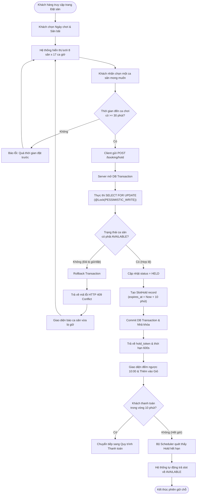
*Hình 2.4: Sơ đồ hoạt động Quy trình Đặt sân và Giữ chỗ 10 phút*

---

### 2.3.2. Quy trình Thanh toán giỏ hàng hỗn hợp và Xử lý Webhook IPN
Quy trình thực thi giao dịch nguyên tử (Atomic Saga) đối với giỏ hàng chứa cả ca sân và sản phẩm bán lẻ, kết hợp bước xử lý Webhook bất đồng bộ có xác thực chữ ký số HMAC-SHA256:

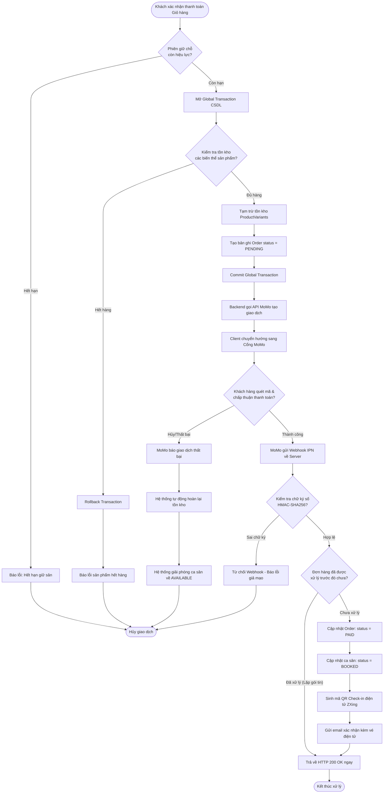
*Hình 2.5: Sơ đồ hoạt động Quy trình Thanh toán đơn hàng kết hợp & Webhook MoMo*

---

### 2.3.3. Quy trình Bán hàng tại quầy POS và Check-in vé vào sân bằng mã QR
Quy trình nghiệp vụ thực tế diễn ra tại quầy lễ tân cơ sở thể thao phục vụ bán lẻ và xác nhận lượt khách vào sân:

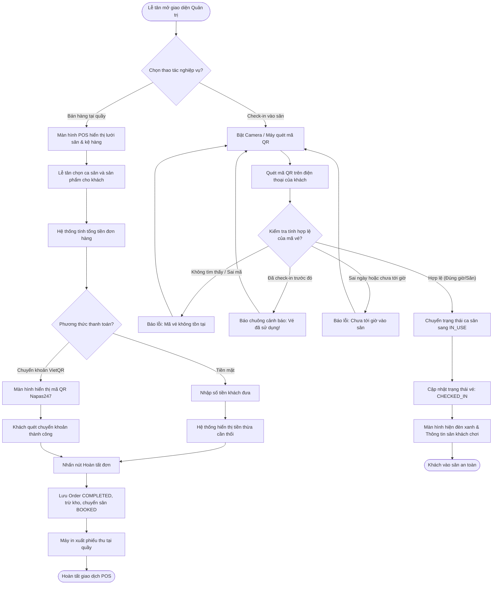
*Hình 2.6: Sơ đồ hoạt động Quy trình Bán hàng tại quầy POS & Quét mã QR Check-in*

---

## 2.4. Yêu cầu phi chức năng và ràng buộc

### 2.4.1. Yêu cầu phi chức năng (Non-Functional Requirements - NFR)
Các yêu cầu phi chức năng được chuẩn hóa dựa trên mô hình chất lượng phần mềm ISO/IEC 25010 nhằm thiết lập cơ sở vững chắc cho các quyết định kiến trúc ở Chương 3:

| Mã NFR | Nhóm chất lượng | Thuộc tính cụ thể | Chỉ số đo lường định lượng và mục tiêu kỹ thuật |
| :---: | :--- | :--- | :--- |
| **NFR01** | Hiệu năng (Performance) | Thời gian phản hồi (Latency) | - 95% các yêu cầu tra cứu lịch sân và danh mục sản phẩm có thời gian phản hồi $\le 200$ ms.<br/>- Thao tác khóa giữ chỗ ca sân (`holdSlot`) hoàn tất trong vòng $\le 500$ ms. |
| **NFR02** | Hiệu năng (Performance) | Thông lượng (Throughput) | Hệ thống máy chủ chịu tải tối thiểu 200 yêu cầu đồng thời/giây (RPS) vào các đợt mở đăng ký khung giờ vàng mà không phát sinh lỗi HTTP 5xx. |
| **NFR03** | Tính sẵn sàng (Availability) | Độ ổn định hệ thống | Đảm bảo tỷ lệ thời gian hoạt động của API máy chủ đạt mức tối thiểu 99.9% (thời gian gián đoạn kế hoạch tối đa không quá 43 phút/tháng). |
| **NFR04** | Tính bảo mật (Security) | Xác thực & Mã hóa | - Mật khẩu người dùng được băm bằng thuật toán BCrypt với hệ số tải (work factor) $R=12$.<br/>- Toàn bộ giao tiếp mạng bắt buộc truyền tải trên kênh mã hóa HTTPS/TLS 1.3.<br/>- Xác thực API thông qua Bearer Token có thời hạn và mã hóa chữ ký. |
| **NFR05** | Tính toàn vẹn (Integrity) | Chống xung đột dữ liệu | Tuyệt đối không để xảy ra hiện tượng đặt trùng ca sân (Zero Double-Booking). Đảm bảo chuẩn giao dịch ACID ở mọi luồng thanh toán giỏ hàng hỗn hợp. |
| **NFR06** | Tính bảo mật (Security) | Toàn vẹn Webhook | Xác thực chữ ký điện tử HMAC-SHA256 trên mọi gói tin thông báo trạng thái từ Cổng MoMo; đảm bảo tính Idempotency (xử lý lặp không gây sai lệch dữ liệu). |
| **NFR07** | Khả năng sử dụng (Usability) | Thời gian hoàn tất thao tác | Thao tác check-in khách tại quầy bằng mã QR phản hồi kết quả trong vòng $\le 2$ giây. Giao diện người dùng tương thích hoàn toàn trên cả máy tính và điện thoại thông minh (Responsive Design). |
| **NFR08** | Khả năng bảo trì (Maintainability) | Kiến trúc phân tầng | Các tầng nghiệp vụ phân tách độc lập (SoC); độ che phủ mã nguồn kiểm thử (Code Coverage) đạt trên 75% cho các dịch vụ cốt lõi. |

*Bảng 2.6: Danh mục yêu cầu phi chức năng hệ thống (Non-Functional Requirements)*

---

### 2.4.2. Các ràng buộc hệ thống (System Constraints)
1. **Ràng buộc nghiệp vụ (Business Rules)**:
   * **Quy tắc thời hạn giữ chỗ (Hold Expiration)**: Ca sân tạm giữ chỉ được bảo lưu độc quyền trong đúng 600 giây (10 phút). Sau khoảng thời gian này, nếu chưa phát sinh giao dịch thanh toán thành công, hệ thống phải tự động hoàn trả ca sân về trạng thái sẵn sàng (`available`).
   * **Quy tắc thời gian đặt trước (Cut-off Time)**: Khách hàng chỉ được phép đặt ca sân trước giờ bắt đầu tối thiểu 30 phút. Các ca sân diễn ra trong vòng dưới 30 phút sẽ bị khóa trên cổng trực tuyến, chỉ có nhân viên lễ tân mới có quyền mở bán tại quầy POS.
   * **Quy tắc hủy đặt sân (Cancellation Policy)**: Khách hàng chỉ được quyền hủy đơn đặt sân trước thời điểm bắt đầu thi đấu tối thiểu 12 tiếng. Hủy trước 24 tiếng được hoàn 100% tiền; hủy trong khoảng 12 – 24 tiếng được hoàn 50%; dưới 12 tiếng không hỗ trợ hoàn tiền.
2. **Ràng buộc công nghệ và kỹ thuật (Technical Constraints)**:
   * **Kiến trúc tách rời (Decoupled Headless)**: Hệ thống bắt buộc xây dựng theo mô hình Backend RESTful API độc lập, giao tiếp với các máy khách Frontend thông qua chuẩn JSON. Backend không sinh mã HTML trực tiếp.
   * **Tính tương thích đa nền tảng**: Giao diện Client và Admin phải thực thi độc lập trên các trình duyệt hiện đại (Chrome, Safari, Edge, Firefox) mà không cần cài đặt thêm phần mềm phụ trợ.
   * **Múi giờ vận hành**: Toàn bộ mốc thời gian lưu trữ và tính toán trong cơ sở dữ liệu phải được quy chuẩn theo múi giờ Việt Nam (`Asia/Ho_Chi_Minh` - UTC+7) để đảm bảo tính đồng nhất giữa máy chủ và người dùng.


---

\newpage

# CHƯƠNG 3. THIẾT KẾ KIẾN TRÚC

## 3.1. Thể loại hệ thống và tiêu chí lựa chọn

### 3.1.1. Phân loại thể loại hệ thống
Dựa trên phân loại thể loại kiến trúc phần mềm trong kỹ nghệ hệ thống (Software Engineering), hệ thống **PickleBallWeb** được định vị là một **Hệ thống xử lý giao dịch tương tác phân tán (Distributed Interactive Transaction Processing System)**:
1. **Hệ thống tương tác (Interactive System)**: Người dùng (người chơi và nhân viên thu ngân) thao tác liên tục trên giao diện trực quan theo thời gian thực (chọn sân, đổi ngày, thêm phụ kiện, kiểm tra mã giảm giá). Trải nghiệm người dùng đòi hỏi độ trễ cực thấp, giao diện SPA mượt mà không tải lại toàn trang.
2. **Hệ thống xử lý giao dịch (Transaction Processing System - TPS)**: Cốt lõi của bài toán là xử lý các nghiệp vụ thương mại tài chính và tài nguyên hữu hạn: đặt chỗ, giữ sân, trừ tồn kho, thanh toán điện tử, hủy đơn hoàn tiền. Mọi giao dịch phải tuân thủ nghiêm ngặt chuẩn thuộc tính ACID:
   * **Nguyên tử (Atomicity)**: Toàn bộ quá trình tạo đơn hàng gồm đặt ca sân và trừ tồn kho các biến thể phụ kiện thể thao phải thành công trọn vẹn, hoặc bị hủy bỏ hoàn toàn nếu có bất kỳ bước nào thất bại.
   * **Nhất quán (Consistency)**: Trạng thái cơ sở dữ liệu chuyển từ trạng thái hợp lệ này sang trạng thái hợp lệ khác (tổng tiền thanh toán khớp đúng với đơn giá ca sân cộng tổng giá trị hàng hóa trừ khuyến mãi).
   * **Cô lập (Isolation)**: Các thao tác đặt sân của nhiều khách hàng đồng thời tại cùng một tích tắc không được can thiệp đè lên nhau (chống Double-booking).
   * **Bền vững (Durability)**: Khi giao dịch thanh toán thành công và được xác nhận bởi MoMo IPN, dữ liệu được ghi nhận vĩnh viễn vào bộ nhớ lưu trữ bền vững.
3. **Hệ thống phân tán (Distributed System)**: Ứng dụng không chạy trên một máy tính cục bộ đơn lẻ mà phân bố trên môi trường mạng: Ứng dụng Web Client/Admin chạy trên trình duyệt người dùng, Máy chủ dịch vụ API xử lý tại trung tâm dữ liệu, Hệ thống CSDL lưu trữ tập trung, và Cổng thanh toán MoMo hoạt động qua hạ tầng đám mây công cộng kết nối qua Internet.

### 3.1.2. Tiêu chí lựa chọn kiến trúc
Để đáp ứng bài toán trên, các tiêu chí kỹ thuật cốt lõi được đặt ra làm căn cứ lựa chọn giải pháp kiến trúc:
* **Tính toàn vẹn và nhất quán dữ liệu (Data Integrity)**: Tiêu chí ưu tiên số một, tuyệt đối không cho phép lỗi đặt trùng sân hoặc sai lệch kho hàng.
* **Khả năng đáp ứng và độ trễ (Performance & Latency)**: Tối ưu hóa thời gian phản hồi cho các yêu cầu đọc dữ liệu lịch sân và hỗ trợ cơ chế khóa dữ liệu nhanh ở mức micro-second.
* **Tính phân tách mối quan tâm và khả năng kiểm thử (SoC & Testability)**: Tách rời hoàn toàn giao diện khỏi logic máy chủ; các tầng nghiệp vụ độc lập cho phép viết Unit Test và Integration Test dễ dàng.
* **Khả năng bảo trì và chi phí vận hành (Maintainability & Cost)**: Kiến trúc không quá cồng kềnh, giảm thiểu chi phí máy chủ và độ phức tạp trong vận hành so với mô hình Microservices quá phân mảnh.

---

## 3.2. Lựa chọn phong cách kiến trúc

### 3.2.1. So sánh các phương án kiến trúc theo tiêu chí kỹ thuật
Nhóm nghiên cứu tiến hành đánh giá ba phong cách kiến trúc ứng viên phổ biến:
1. **Phương án 1: Kiến trúc nguyên khối truyền thống (Traditional Monolithic MVC - Server-Side Rendering)**.
2. **Phương án 2: Kiến trúc phân lớp kết hợp Khách - Chủ tách rời (Layered Architecture with Headless RESTful API & Dual SPA)**.
3. **Phương án 3: Kiến trúc Vi dịch vụ hoàn chỉnh (Full Microservices Architecture với nhiều DB riêng biệt)**.

| Tiêu chí so sánh | Phương án 1: Monolithic MVC | Phương án 2: Layered + Headless REST (Lựa chọn) | Phương án 3: Microservices hoàn chỉnh |
| :--- | :--- | :--- | :--- |
| **Độ phức tạp triển khai & vận hành** | Rất thấp (1 tiến trình duy nhất) | **Thấp - Trung bình** (Backend API + 2 SPA tĩnh) | Rất cao (Kubernetes, API Gateway, Service Mesh) |
| **Trải nghiệm giao diện (UX/UI)** | Thấp (Tải lại toàn trang F5, độ trễ mạng lớn) | **Rất cao** (SPA mượt mà, đếm ngược thời gian thực) | Rất cao (Tương đương Phương án 2) |
| **Tính toàn vẹn giao dịch (ACID)** | Rất cao (Giao dịch cục bộ trên 1 CSDL) | **Rất cao** (Hỗ trợ Global Transaction & Khóa bi quan) | Kém/Phức tạp (Phải dùng 2PC hoặc Distributed Saga) |
| **Phân tách trách nhiệm (SoC)** | Kém (Mã HTML trộn lẫn Controller) | **Tuyệt vời** (API thuần JSON, UI đóng gói độc lập) | Tuyệt vời |
| **Khả năng mở rộng đa giao diện** | Khó khăn khi mở thêm Mobile App | **Rất dễ dàng** (Tái sử dụng chung 1 tập REST API) | Rất dễ dàng |
| **Chi phí hạ tầng máy chủ** | Thấp | **Tối ưu** (Frontend lưu trên CDN tĩnh, Backend chuyên sâu) | Rất tốn kém (Yêu cầu tài nguyên lớn) |

*Bảng 3.1: So sánh các phương án kiến trúc phần mềm theo tiêu chí chất lượng*

---

### 3.2.2. Quyết định lựa chọn kiến trúc phân lớp và Headless Decoupled
Căn cứ vào Bảng so sánh 3.1, nhóm nghiên cứu quyết định lựa chọn **Phương án 2: Kiến trúc phân tầng (Layered Architecture) kết hợp mô hình Khách - Chủ tách rời (Headless Decoupled RESTful API)** làm kiến trúc chủ đạo của hệ thống vì các lý do chiến lược:
1. **Phân tách hoàn hảo giữa Tầng Trình diễn và Tầng Nghiệp vụ**: Backend đóng vai trò máy chủ API chuyên trách tính toán logic và bảo vệ dữ liệu, không tiêu tốn CPU vào việc sinh mã HTML. Hai ứng dụng Frontend React (`demopick-client` và `demopick-admin`) được biên dịch thành các tệp tài nguyên tĩnh, có thể triển khai lên mạng phân phối nội dung (CDN), mang lại tốc độ tải trang cực nhanh và tính thẩm mỹ cao.
2. **Bảo toàn khả năng quản lý giao dịch ACID tập trung**: Khác với Microservices phải chịu rủi ro về tính nhất quán sau cùng (Eventual Consistency) rất nguy hiểm đối với bài toán giữ chỗ ca sân 10 phút; kiến trúc phân tầng tập trung cho phép kích hoạt khóa bi quan `@Lock(PESSIMISTIC_WRITE)` và xử lý giao dịch nguyên tử (Atomic Transaction) một cách chuẩn xác, an toàn tuyệt đối.
3. **Tính sẵn sàng mở rộng trong tương lai**: Nếu trong tương lai doanh nghiệp phát triển thêm ứng dụng di động cho vận động viên trên iOS/Android hoặc màn hình hiển thị tỷ số thông minh (Smart Scoreboard) tại sân, toàn bộ hệ sinh thái mới này chỉ cần gọi trực tiếp các REST API đã có mà không phải tái cấu trúc lại Backend.

---

### 3.2.3. Quan hệ giữa phong cách kiến trúc, mẫu kiến trúc và mẫu thiết kế
Trong hệ thống PickleBallWeb, ba cấp độ trừu tượng hóa kỹ thuật được tổ chức có tôn ti trật tự:
* **Phong cách kiến trúc (Architectural Style)**: Xác định quy tắc vĩ mô cấp hệ thống — **Client-Server Headless kết hợp Layered Architecture**.
* **Mẫu kiến trúc (Architectural Patterns)**: Định hình cách thức tổ chức các tầng bên trong Backend — **Mẫu phân 3 tầng chuẩn (3-Tier Pattern)** gồm Presentation (REST Controller), Business Logic (Service Layer), và Data Access (Repository Pattern).
* **Mẫu thiết kế (Design Patterns)**: Giải quyết các bài toán vi mô bên trong từng lớp đối tượng:
  * *DTO Pattern*: Chuẩn hóa thông điệp Request/Response qua mạng.
  * *Pessimistic Locking Pattern*: Khóa bản ghi dữ liệu chống tranh chấp đồng thời ca sân.
  * *Strategy Pattern*: Đóng gói các thuật toán tích hợp cổng thanh toán (MoMo, VietQR).
  * *BCE Pattern*: Phân định ranh giới giữa lớp Biên (Boundary), lớp Điều khiển (Control) và lớp Thực thể (Entity).

---

## 3.3. Kiến trúc tổng thể của hệ thống

### 3.3.1. Sơ đồ kiến trúc tổng thể (Architecture Diagram)
Hệ thống được tổ chức thành 4 phân tầng logic chính kết hợp 2 tác nhân ngoại vi thông qua các kênh truyền bảo mật HTTPS:

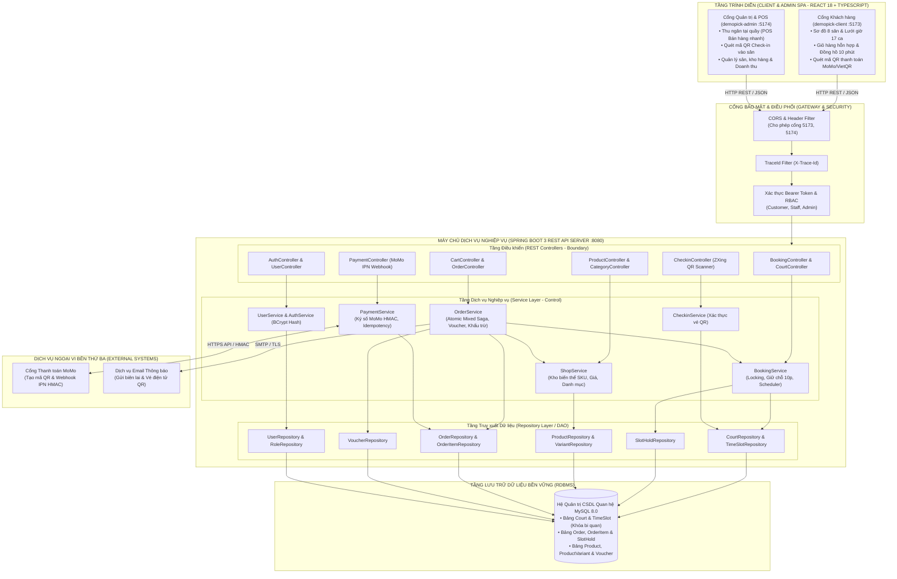
*Hình 3.1: Sơ đồ kiến trúc tổng thể hệ thống theo mô hình Headless Decoupled & Phân tầng*

---

### 3.3.2. Trách nhiệm của từng tầng trong kiến trúc
Kiến trúc phân tầng áp dụng nguyên tắc phân định trách nhiệm rõ ràng (Clear Separation of Concerns):
1. **Tầng Trình diễn (Presentation Tier / Frontend SPA)**:
   * Chịu trách nhiệm trực quan hóa dữ liệu và xử lý các sự kiện tương tác của người dùng.
   * Quản lý trạng thái giao diện cục bộ (State Management): bộ đếm ngược 10 phút giữ sân, trạng thái giỏ hàng, thông báo Toast.
   * Kiểm tra tính hợp lệ sơ bộ của biểu mẫu dữ liệu (Form Client-side Validation) trước khi gửi đi.
   * Gửi và nhận dữ liệu thuần định dạng JSON thông qua thư viện Axios HTTP Client, gắn kèm Bearer Token vào tiêu đề (Header).
2. **Tầng Điều khiển (Controller Layer / Boundary Layer)**:
   * Tiếp nhận các yêu cầu HTTP Request, giải mã chuỗi JSON thành các đối tượng DTO (Data Transfer Object).
   * Kiểm tra tính hợp lệ dữ liệu đầu vào (Server-side Validation): kiểm tra trường bắt buộc, định dạng email, khoảng giá trị số dương.
   * Đóng gói mã nguồn nghiệp vụ: không thực hiện bất kỳ tính toán logic phức tạp nào tại đây; ủy quyền toàn bộ việc xử lý cho Tầng Dịch vụ (Service Layer).
   * Chuẩn hóa cấu trúc dữ liệu trả về cho Client theo định dạng JSON thống nhất (gồm `data`, `message`, `error`, `meta`).
3. **Tầng Dịch vụ (Service Layer / Control Layer)**:
   * Là "trái tim" của hệ thống, nơi tập trung toàn bộ các quy tắc nghiệp vụ (Business Rules).
   * Quản lý ranh giới giao dịch cơ sở dữ liệu (Transaction Boundary): mở giao dịch, xác định điểm rollback khi gặp lỗi nghiệp vụ.
   * Thực thi các giải thuật then chốt: khóa bi quan ca sân, tính tiền giờ cao điểm/thấp điểm, kiểm tra tồn kho theo từng biến thể sản phẩm, tính toán giá trị voucher, ký và xác minh chữ ký số HMAC-SHA256 của MoMo.
   * Điều phối tương tác giữa các Service phụ thuộc (ví dụ: `OrderService` gọi `BookingService` để khóa ca sân và gọi `ShopService` để trừ kho).
4. **Tầng Truy xuất Dữ liệu (Repository / Data Access Layer)**:
   * Trừu tượng hóa các câu lệnh thao tác với cơ sở dữ liệu quan hệ, che giấu các câu lệnh SQL cụ thể.
   * Cung cấp các phương thức truy vấn chuẩn (CRUD) và các phương thức truy vấn nghiệp vụ đặc thù (ví dụ: `findSlotWithLock`, `findAvailableSlotsByDate`, `findActiveHold`).
5. **Tầng Cơ sở Dữ liệu (Storage Tier / Database)**:
   * Đảm bảo việc lưu trữ dữ liệu an toàn, bền vững trên đĩa cứng.
   * Thực thi các ràng buộc toàn vẹn quan hệ (Khóa chính, Khóa ngoại, Ràng buộc Unique, Kiểm tra miền giá trị).
   * Quản lý cơ chế khóa ở mức bản ghi (Row-Level Locking) phục vụ cho truy vấn khóa bi quan `SELECT ... FOR UPDATE`.

---

### 3.3.3. Quy tắc phụ thuộc và trao đổi dữ liệu giữa các tầng
Nhằm đảm bảo nguyên lý Ghép nối lỏng (Loose Coupling) và Đơn trách nhiệm (Single Responsibility), hệ thống thiết lập các quy tắc bất biến:
* **Quy tắc phụ thuộc một chiều (Downward Dependency Rule)**: Tầng trên chỉ được phép gọi xuống tầng liền kề bên dưới nó (`Presentation` $\rightarrow$ `Controller` $\rightarrow$ `Service` $\rightarrow$ `Repository` $\rightarrow$ `Database`). Tuyệt đối không cho phép tầng dưới gọi ngược lên tầng trên hoặc nhảy cóc (ví dụ: Controller không bao giờ được gọi thẳng tới Repository để bỏ qua Service).
* **Đóng gói dữ liệu bằng DTO**: Tầng Controller và tầng Client chỉ trao đổi dữ liệu qua các DTO (ví dụ: `HoldSlotRequest`, `CheckoutRequest`, `OrderResponseDTO`). Tuyệt đối không để lộ các đối tượng Thực thể (Entity Model) trực tiếp ra giao diện web nhằm ngăn chặn việc rò rỉ cấu trúc CSDL và các thông tin nhạy cảm (như mật khẩu băm, mã khóa bí mật).

---

## 3.4. Phân rã hệ thống thành các thành phần

### 3.4.1. Danh mục thành phần và trách nhiệm

| Tên thành phần (Subsystem) | Mã phân hệ | Trách nhiệm xử lý nghiệp vụ chính |
| :--- | :---: | :--- |
| **Phân hệ Quản lý Sân & Đặt chỗ (Booking Subsystem)** | `SUB-01` | Quản lý thông tin 8 sân; phân bổ 17 ca giờ/ngày; thực thi khóa bi quan chống tranh chấp; thiết lập phiên giữ chỗ 10 phút; tự động quét giải phóng ca sân hết hạn. |
| **Phân hệ Thương mại Thiết bị (Shop Subsystem)** | `SUB-02` | Quản lý danh mục 42 sản phẩm thể thao; quản lý chi tiết theo biến thể SKU (Màu sắc, Kích cỡ); trừ kho và hoàn kho tự động theo từng biến thể. |
| **Phân hệ Đơn hàng & Giỏ hàng (Order Subsystem)** | `SUB-03` | Quản lý giỏ hàng kết hợp (sân + phụ kiện); điều phối giao dịch nguyên tử (Atomic Saga) khi thanh toán; áp dụng quy tắc mã giảm giá Voucher. |
| **Phân hệ Cổng Thanh toán (Payment Subsystem)** | `SUB-04` | Tích hợp Cổng thanh toán MoMo; tạo mã QR chuyển khoản VietQR; xác thực chữ ký điện tử HMAC-SHA256; xử lý Webhook IPN đảm bảo Idempotency. |
| **Phân hệ Điểm Bán hàng & Check-in (POS & Checkin Subsystem)** | `SUB-05` | Cung cấp giao diện bán hàng nhanh tại quầy; sinh vé điện tử chứa mã QR; quét và xác thực mã vé vào sân bằng thư viện ZXing. |
| **Phân hệ Người dùng & Phân quyền (User Subsystem)** | `SUB-06` | Đăng ký, đăng nhập tài khoản; mã hóa mật khẩu BCrypt; cấp phát và kiểm soát mã thông báo truy cập Bearer Token; phân quyền RBAC (Customer, Staff, Admin). |

*Bảng 3.2: Danh mục các phân hệ thành phần và trách nhiệm xử lý*

---

### 3.4.2. Sơ đồ phân rã thành phần và mối quan hệ phụ thuộc (Subsystem Decomposition)

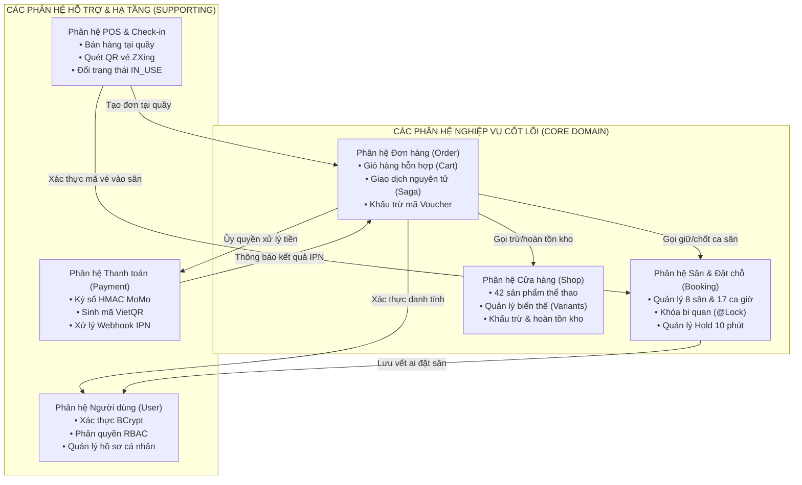
*Hình 3.2: Sơ đồ phân rã thành phần và mối quan hệ phụ thuộc*

---

### 3.4.3. Phụ thuộc giữa các thành phần (Component Dependency)
Sơ đồ Hình 3.2 thể hiện rõ sự tuân thủ các nguyên lý thiết kế:
* **Tính độc lập của Phân hệ Đặt chỗ (Booking) và Cửa hàng (Shop)**: `Booking Subsystem` và `Shop Subsystem` hoàn toàn không phụ thuộc lẫn nhau. Một thay đổi về thuộc tính sản phẩm (như thêm màu mới) không bao giờ ảnh hưởng tới cấu trúc ca sân hay thuật toán khóa chỗ.
* **Vai trò Nhạc trưởng của Phân hệ Đơn hàng (Order Subsystem - Orchestrator)**: `Order Subsystem` đóng vai trò là thành phần điều phối cao cấp. Nó tiếp nhận giỏ hàng từ người dùng, sau đó triệu gọi các dịch vụ chuyên biệt của `Booking` và `Shop` để hoàn tất một giao dịch toàn vẹn. Nhờ đó, tính kết hợp giữa dịch vụ sân bãi và hàng hóa bán lẻ đạt được mức tối ưu mà vẫn giữ được tính ghép nối lỏng giữa các phân hệ cơ sở.

---

## 3.5. Đánh giá kiến trúc

### 3.5.1. Phương pháp đánh giá kiến trúc phần mềm ATAM
Nhằm khẳng định tính đúng đắn và tính khoa học của kiến trúc đã đề xuất, nhóm nghiên cứu vận dụng phương pháp **ATAM (Architecture Tradeoff Analysis Method)** do Viện Kỹ nghệ Phần mềm SEI (Carnegie Mellon University) phát triển. Phương pháp này tập trung vào việc đánh giá khả năng kiến trúc thỏa mãn các thuộc tính chất lượng (Quality Attributes) thông qua các kịch bản cụ thể (Scenarios), từ đó phát hiện các điểm nhạy cảm (Sensitivity Points), điểm đánh đổi (Tradeoff Points) và các rủi ro tiềm ẩn (Risks).

---

### 3.5.2. Đánh giá theo các kịch bản chất lượng (Quality Attribute Scenarios)

| Mã kịch bản | Thuộc tính chất lượng | Tác nhân & Kích thích (Stimulus) | Môi trường hệ thống | Phản hồi kiến trúc & Cơ chế xử lý kỹ thuật | Tiêu chí đo lường đạt chuẩn | Đánh giá |
| :---: | :--- | :--- | :--- | :--- | :--- | :---: |
| **SC-01** | Tính toàn vẹn (Integrity) & Hiệu năng | 50 khách hàng cùng bấm đặt một ca sân vàng (Sân A1, 18:00–19:00) tại cùng một thời điểm. | Khung giờ cao điểm, tải hệ thống tăng vọt. | Cơ chế Khóa bi quan (`@Lock(PESSIMISTIC_WRITE)`) khóa hàng dữ liệu tại CSDL. Chỉ duy nhất 1 giao dịch được cấp phát hold; 49 giao dịch còn lại nhận lỗi HTTP 409 Conflict tức thì. | Tuyệt đối không có 2 người cùng giữ 1 sân; thời gian phản hồi khóa $\le 300$ ms. | **ĐẠT** |
| **SC-02** | Tính toàn vẹn & Độ tin cậy (Reliability) | Khách thanh toán đơn hỗn hợp (1 ca sân + 2 vợt), CSDL trừ kho vợt thành công nhưng ca sân bị lỗi mạng. | Sự cố kết nối nội bộ giữa các dịch vụ. | Toàn bộ các thao tác được bọc trong `@Transactional`. Khi bước giữ sân lỗi, Spring Boot tự động kích hoạt Rollback, hoàn trả lại số lượng tồn kho của vợt về trạng thái ban đầu. | Không sinh ra đơn hàng rác "nửa vời"; tồn kho bảo toàn 100%. | **ĐẠT** |
| **SC-03** | Tính bảo mật (Security) & Bền vững | Hacker giả mạo gói tin MoMo Webhook IPN gửi kết quả `status=PAID` với chữ ký sai. | Môi trường Internet công cộng, nguy cơ tấn công man-in-the-middle. | Tầng PaymentService tính toán lại chữ ký HMAC-SHA256 dựa trên Secret Key lưu tại máy chủ. Chữ ký không khớp lập tức bị từ chối với HTTP 400. | Đơn hàng không bị kích hoạt thanh toán lậu; hệ thống ghi log cảnh báo an ninh. | **ĐẠT** |
| **SC-04** | Tính sẵn sàng (Availability) | Cổng MoMo bị chập chờn mạng và gửi lặp lại 3 lần cùng một gói tin IPN cho một đơn hàng. | Sự cố truyền thông mạng phía đối tác thanh toán. | Cơ chế Idempotency kiểm tra trạng thái đơn: nếu đơn đã là `PAID`, hệ thống bỏ qua việc cập nhật trùng lặp và phản hồi ngay mã HTTP 200 OK cho MoMo. | Không xảy ra lỗi cộng dồn tiền hoặc kích hoạt vé 2 lần. | **ĐẠT** |

*Bảng 3.3: Bảng ma trận kịch bản đánh giá chất lượng kiến trúc theo ATAM*

---

### 3.5.3. Điểm nhạy cảm, điểm đánh đổi và rủi ro kiến trúc
1. **Điểm nhạy cảm (Sensitivity Points)**:
   * **Hiệu năng khóa CSDL (Lock Duration)**: Thời gian giữ Transaction khi thực hiện `@Lock(PESSIMISTIC_WRITE)` là điểm cực kỳ nhạy cảm. Nếu logic bên trong transaction quá dài (ví dụ: gọi thêm API ngoài trong lúc đang giữ lock), kết nối CSDL sẽ bị nghẽn (Connection Pool Exhaustion). *Giải pháp*: Giữ transaction cực ngắn, chỉ thực hiện kiểm tra trạng thái và cập nhật trường `status` rồi commit ngay lập tức.
2. **Điểm đánh đổi (Tradeoff Points)**:
   * **Đánh đổi giữa Tính nhất quán tuyệt đối (Consistency) và Độ trễ cực đại (Latency)**: Việc áp dụng Khóa bi quan (Pessimistic Lock) buộc các yêu cầu tranh chấp phải xếp hàng chờ đợi, làm tăng nhẹ độ trễ phản hồi so với Khóa lạc quan (Optimistic Lock). Tuy nhiên, sự đánh đổi này là hoàn toàn xứng đáng vì nó triệt tiêu 100% rủi ro đặt trùng sân — yếu tố sống còn của một khu phức hợp thể thao.
3. **Rủi ro kiến trúc và Biện pháp giảm thiểu (Risks & Mitigations)**:
   * *Rủi ro*: Khách hàng giữ chỗ 10 phút nhưng đóng trình duyệt bỏ đi, ca sân bị treo ở trạng thái `held` làm mất cơ hội của người khác.
   * *Biện pháp giảm thiểu*: Cài đặt tác vụ nền lập lịch tự động (`@Scheduled(cron = "*/15 * * * * *")`) quét liên tục mỗi 15 giây các bản ghi giữ chỗ có `expires_at < Now()` để tự động giải phóng ca sân về `available` và phát tín hiệu cho các người dùng khác.


---

\newpage

# CHƯƠNG 4. THIẾT KẾ DỮ LIỆU VÀ LỚP

## 4.1. Thiết kế dữ liệu

### 4.1.1. Thực thể và thuộc tính
Mô hình dữ liệu của hệ thống PickleBallWeb được thiết kế chuẩn hóa đến mức Dạng chuẩn 3 (3NF - Third Normal Form) nhằm đảm bảo tối ưu hóa dung lượng lưu trữ, triệt tiêu sự dư thừa dữ liệu và ngăn ngừa các dị thường khi thêm, sửa, xóa dữ liệu. 

Dưới đây là từ điển dữ liệu (Data Dictionary) của các thực thể cốt lõi trong hệ thống:

| Tên thực thể | Tên thuộc tính | Kiểu dữ liệu | Ràng buộc kỹ thuật | Diễn giải ý nghĩa nghiệp vụ |
| :--- | :--- | :--- | :--- | :--- |
| **`courts`** | `id` | BIGINT | PRIMARY KEY, AUTO_INCREMENT | Khóa chính định danh sân |
| | `name` | VARCHAR(100) | NOT NULL, UNIQUE | Tên sân (Ví dụ: "Sân A1", "Sân B2") |
| | `type` | ENUM | 'INDOOR', 'OUTDOOR' | Loại sân: Trong nhà có mái che hoặc ngoài trời |
| | `status` | ENUM | 'ACTIVE', 'MAINTENANCE', 'CLOSED' | Trạng thái hoạt động của sân |
| | `description` | TEXT | NULLABLE | Mô tả chi tiết về mặt sân, hệ thống đèn chiếu sáng |
| **`time_slots`** | `id` | BIGINT | PRIMARY KEY, AUTO_INCREMENT | Khóa chính định danh ca giờ sân |
| | `court_id` | BIGINT | FOREIGN KEY $\rightarrow$ `courts(id)` | Khóa ngoại liên kết tới sân bãi |
| | `booking_date` | DATE | NOT NULL | Ngày diễn ra ca chơi (YYYY-MM-DD) |
| | `start_time` | TIME | NOT NULL | Giờ bắt đầu ca chơi (Ví dụ: 17:00:00) |
| | `end_time` | TIME | NOT NULL | Giờ kết thúc ca chơi (Ví dụ: 18:00:00) |
| | `price` | DECIMAL(12,2) | NOT NULL, CHECK ($price \ge 0$) | Đơn giá thuê ca sân (Phân biệt Peak / Off-peak) |
| | `status` | ENUM | 'available', 'held', 'booked', 'in_use', 'locked' | Trạng thái ca sân phục vụ nghiệp vụ |
| **`slot_holds`** | `id` | BIGINT | PRIMARY KEY, AUTO_INCREMENT | Khóa chính phiên giữ chỗ tạm thời |
| | `slot_id` | BIGINT | FOREIGN KEY $\rightarrow$ `time_slots(id)` | Khóa ngoại liên kết ca sân được giữ |
| | `user_id` | BIGINT | FOREIGN KEY $\rightarrow$ `users(id)`, NULL | Khóa ngoại liên kết người dùng thực hiện giữ |
| | `hold_token` | VARCHAR(64) | NOT NULL, UNIQUE | Chuỗi mã bí mật bảo vệ phiên giữ chỗ |
| | `expires_at` | DATETIME | NOT NULL | Thời điểm chính xác phiên giữ chỗ hết hạn (10 phút) |
| | `status` | ENUM | 'ACTIVE', 'EXPIRED', 'CONVERTED', 'CANCELLED' | Trạng thái của phiên giữ chỗ |
| **`products`** | `id` | BIGINT | PRIMARY KEY, AUTO_INCREMENT | Khóa chính sản phẩm thể thao |
| | `name` | VARCHAR(255) | NOT NULL | Tên thương mại sản phẩm (Ví dụ: "Vợt Selkirk Vanguard") |
| | `slug` | VARCHAR(255) | NOT NULL, UNIQUE | Đường dẫn tĩnh thân thiện (SEO URL) |
| | `category_id` | BIGINT | FOREIGN KEY $\rightarrow$ `categories(id)` | Nhóm phân loại (Vợt, Bóng, Túi, Phụ kiện) |
| | `base_price` | DECIMAL(12,2) | NOT NULL | Giá gốc niêm yết của dòng sản phẩm |
| | `status` | ENUM | 'ACTIVE', 'INACTIVE' | Trạng thái kinh doanh sản phẩm |
| **`product_variants`** | `id` | BIGINT | PRIMARY KEY, AUTO_INCREMENT | Khóa chính biến thể sản phẩm |
| | `product_id` | BIGINT | FOREIGN KEY $\rightarrow$ `products(id)` | Khóa ngoại liên kết tới sản phẩm cha |
| | `sku` | VARCHAR(64) | NOT NULL, UNIQUE | Mã đơn vị lưu kho riêng biệt (SKU) |
| | `color` | VARCHAR(50) | NOT NULL | Màu sắc biến thể (Ví dụ: "Xanh Navy", "Đen Carbon") |
| | `size` | VARCHAR(50) | NOT NULL | Kích cỡ biến thể (Ví dụ: "Tiêu chuẩn", "Trọng lượng 8.0oz") |
| | `price_adjustment`| DECIMAL(12,2)| DEFAULT 0.00 | Phần chênh lệch giá so với giá gốc sản phẩm |
| | `stock_quantity` | INT | NOT NULL, CHECK ($stock \ge 0$) | Số lượng sản phẩm còn thực tế trong kho |
| **`orders`** | `id` | BIGINT | PRIMARY KEY, AUTO_INCREMENT | Khóa chính đơn hàng |
| | `order_code` | VARCHAR(32) | NOT NULL, UNIQUE | Mã đơn hàng (Ví dụ: "ORD-20261002-8891") |
| | `user_id` | BIGINT | FOREIGN KEY $\rightarrow$ `users(id)`, NULL | Người đặt hàng (Hỗ trợ khách vãng lai tại POS) |
| | `subtotal` | DECIMAL(12,2) | NOT NULL | Tổng tiền thành phần trước khuyến mãi |
| | `discount_amount` | DECIMAL(12,2)| DEFAULT 0.00 | Số tiền được giảm trừ qua mã khuyến mãi |
| | `total_amount` | DECIMAL(12,2) | NOT NULL | Tổng số tiền thanh toán thực tế cuối cùng |
| | `status` | ENUM | 'PENDING', 'PAID', 'SHIPPING', 'COMPLETED', 'CANCELLED' | Trạng thái vòng đời của đơn hàng |
| | `payment_method` | ENUM | 'MOMO', 'VIETQR', 'CASH' | Phương thức thanh toán được chọn |
| | `created_at` | DATETIME | NOT NULL | Thời điểm khởi tạo đơn hàng |
| **`order_items`** | `id` | BIGINT | PRIMARY KEY, AUTO_INCREMENT | Khóa chính chi tiết mục đơn hàng |
| | `order_id` | BIGINT | FOREIGN KEY $\rightarrow$ `orders(id)` | Khóa ngoại tham chiếu đơn hàng cha |
| | `item_type` | ENUM | 'COURT_SLOT', 'PRODUCT_VARIANT' | Phân loại mục: Thuê ca sân hay Mua hàng hóa |
| | `slot_id` | BIGINT | FOREIGN KEY $\rightarrow$ `time_slots(id)`, NULL | Khóa ngoại nếu mục đơn là ca đặt sân |
| | `variant_id` | BIGINT | FOREIGN KEY $\rightarrow$ `product_variants(id)`, NULL | Khóa ngoại nếu mục đơn là sản phẩm hàng hóa |
| | `unit_price` | DECIMAL(12,2) | NOT NULL | Đơn giá tại thời điểm giao dịch |
| | `quantity` | INT | NOT NULL, DEFAULT 1 | Số lượng mục giao dịch |
| | `line_total` | DECIMAL(12,2) | NOT NULL | Tổng tiền mục ($unit\_price \times quantity$) |
| **`vouchers`** | `id` | BIGINT | PRIMARY KEY, AUTO_INCREMENT | Khóa chính mã khuyến mãi |
| | `code` | VARCHAR(32) | NOT NULL, UNIQUE | Mã khuyến mãi nhập vào (Ví dụ: "PICKLE20") |
| | `discount_type` | ENUM | 'PERCENTAGE', 'FIXED_AMOUNT' | Loại giảm giá: theo % hay theo số tiền cố định |
| | `discount_val` | DECIMAL(12,2) | NOT NULL | Giá trị giảm (Ví dụ: 20% hoặc 50.000 VNĐ) |
| | `min_order_val` | DECIMAL(12,2) | NOT NULL, DEFAULT 0 | Giá trị đơn hàng tối thiểu để được áp dụng |
| | `usage_limit` | INT | NOT NULL, DEFAULT 100 | Số lượt sử dụng tối đa của mã |
| | `used_count` | INT | NOT NULL, DEFAULT 0 | Số lượt đã được khách hàng sử dụng thực tế |
| | `valid_until` | DATETIME | NOT NULL | Thời điểm hết hạn của mã giảm giá |
| **`payment_txs`** | `id` | BIGINT | PRIMARY KEY, AUTO_INCREMENT | Khóa chính giao dịch thanh toán |
| | `order_id` | BIGINT | FOREIGN KEY $\rightarrow$ `orders(id)` | Khóa ngoại tham chiếu đơn hàng tương ứng |
| | `transaction_id`| VARCHAR(100)| NOT NULL, UNIQUE | Mã giao dịch phía Cổng MoMo / Ngân hàng |
| | `amount` | DECIMAL(12,2) | NOT NULL | Số tiền thực tế chuyển khoản |
| | `signature` | VARCHAR(255) | NOT NULL | Chữ ký số HMAC xác thực tính toàn vẹn |
| | `status` | ENUM | 'SUCCESS', 'FAILED', 'PENDING' | Trạng thái giao dịch thanh toán |

*Bảng 4.1: Bảng từ điển dữ liệu các thực thể cốt lõi trong hệ thống*

---

### 4.1.2. Mối quan hệ giữa các thực thể và ràng buộc toàn vẹn
Các mối quan hệ dữ liệu phản ánh chính xác cấu trúc nghiệp vụ thực tế:
1. **Quan hệ giữa Sân bãi và Ca giờ (`courts` 1 — N `time_slots`)**: Một sân thể thao có nhiều ca giờ thi đấu theo từng ngày. Khi một sân bị chuyển sang trạng thái bảo trì (`MAINTENANCE`), các ca giờ thuộc sân đó tự động bị khóa (`locked`).
2. **Quan hệ giữa Ca giờ và Phiên giữ chỗ (`time_slots` 1 — 0..1 `slot_holds`)**: Tại một thời điểm xác định, một ca giờ chỉ có tối đa một phiên giữ chỗ có trạng thái `ACTIVE`. Điều này được bảo vệ bởi ràng buộc nghiệp vụ và khóa bi quan.
3. **Quan hệ giữa Sản phẩm và Biến thể (`products` 1 — N `product_variants`)**: Một dòng sản phẩm mẹ bao gồm nhiều biến thể con phân biệt bởi mã SKU độc nhất và thuộc tính kích cỡ, màu sắc. Tồn kho được quản lý ở cấp biến thể.
4. **Quan hệ Giỏ hàng / Đơn hàng hỗn hợp (`orders` 1 — N `order_items`)**: Một đơn hàng chứa nhiều mục chi tiết. Bằng cách thiết kế cột phân loại `item_type`, một đơn hàng có thể chứa đồng thời cả vé sân (`slot_id`) và hàng hóa bán lẻ (`variant_id`).
5. **Quan hệ Khuyến mãi và Thanh toán**: Một đơn hàng có thể áp dụng 0 hoặc 1 mã giảm giá (`vouchers`), và có 1 hoặc nhiều bản ghi giao dịch thanh toán (`payment_transactions`) ghi nhận lịch sử thanh toán (phục vụ đối soát IPN và thanh toán thử lại khi thất bại).

---

### 4.1.3. Sơ đồ thực thể quan hệ (ERD Diagram)

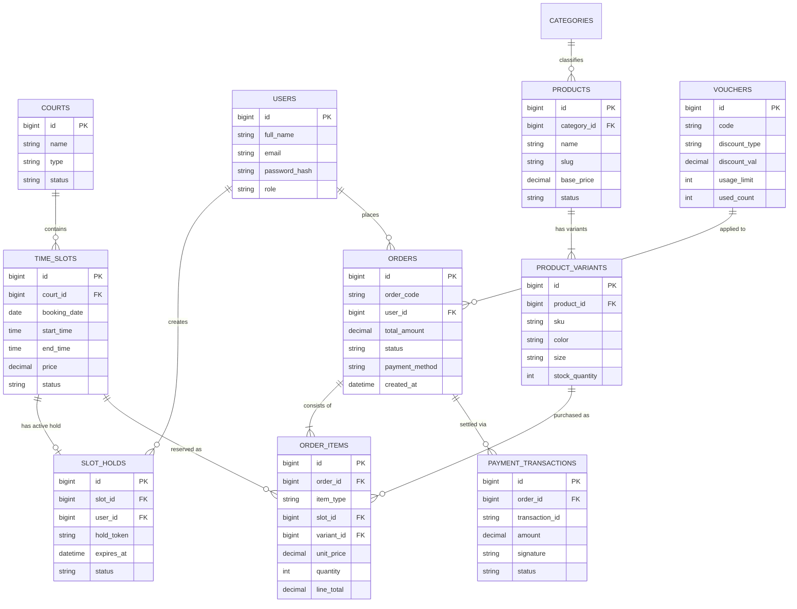
*Hình 4.1: Sơ đồ thực thể quan hệ (ERD - Entity Relationship Diagram)*

---

## 4.2. Thiết kế lớp

### 4.2.1. Xác định lớp và phân bổ trách nhiệm (Mẫu phân loại BCE)
Trong phương pháp luận thiết kế hướng đối tượng (OOAD), mẫu phân loại **Boundary - Control - Entity (BCE)** được áp dụng để phân chia các lớp đối tượng vào ba vai trò kiến trúc rõ rệt:
1. **Lớp Biên (Boundary Classes)**: Đóng vai trò là cổng tiếp nhận yêu cầu từ thế giới bên ngoài (trình duyệt người dùng, cổng MoMo), chuyển đổi giao thức HTTP/JSON thành các đối tượng tham số DTO và ngược lại.
   * `BookingController`: Cung cấp API duyệt sơ đồ sân, ca giờ và yêu cầu giữ chỗ.
   * `ProductController`: Cung cấp API tra cứu danh mục hàng hóa và chi tiết biến thể.
   * `OrderController`: Cung cấp API quản lý giỏ hàng và xử lý thanh toán hỗn hợp.
   * `PaymentController`: Tiếp nhận và phản hồi Webhook IPN từ máy chủ MoMo.
   * `CheckinController`: Tiếp nhận chuỗi mã QR quét từ camera quầy phục vụ check-in.
2. **Lớp Điều khiển (Control Classes / Service Layer)**: Chứa toàn bộ các quy tắc nghiệp vụ, giải thuật tính toán và quản lý các giao dịch dữ liệu.
   * `BookingService`: Điều phối nghiệp vụ khóa bi quan, tính giá ca sân và quản lý vòng đời giữ chỗ 10 phút.
   * `ShopService`: Quản lý tồn kho biến thể SKU, tính toán chênh lệch giá sản phẩm.
   * `OrderService`: Nhạc trưởng điều phối giao dịch nguyên tử (Atomic Saga) khi thanh toán giỏ hàng hỗn hợp.
   * `PaymentService`: Ký chuỗi mật mã HMAC-SHA256 và xác thực chữ ký Webhook MoMo.
   * `CheckinService`: Giải mã chuỗi QR, kiểm tra tính hợp lệ của vé và chuyển trạng thái sân.
3. **Lớp Thực thể (Entity Classes)**: Đại diện cho các khái niệm và dữ liệu nghiệp vụ của thế giới thực, ánh xạ trực tiếp tới các bảng trong CSDL: `Court`, `TimeSlot`, `SlotHold`, `Product`, `ProductVariant`, `Order`, `OrderItem`, `Voucher`, `PaymentTransaction`, `User`.

---

### 4.2.2. Thuộc tính, phương thức và quan hệ giữa các lớp
Mỗi lớp trong hệ thống được định nghĩa đầy đủ với các thuộc tính định danh, trạng thái dữ liệu và các phương thức nghiệp vụ thể hiện tính bao gói (Encapsulation) cao:

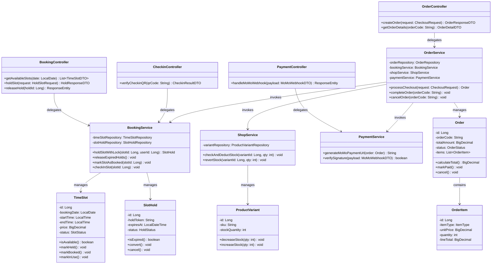
*Hình 4.2: Sơ đồ lớp chi tiết (Class Diagram) theo mẫu BCE và Service Layer*

---

## 4.3. Thiết kế hành vi của đối tượng (State Machine Diagrams)

### 4.3.1. Sơ đồ trạng thái đối tượng Ca sân (TimeSlot)
Ca sân là tài nguyên hữu hạn nhạy cảm nhất của hệ thống. Vòng đời chuyển trạng thái của một ca sân được kiểm soát chặt chẽ nhằm triệt tiêu lỗi tranh chấp:

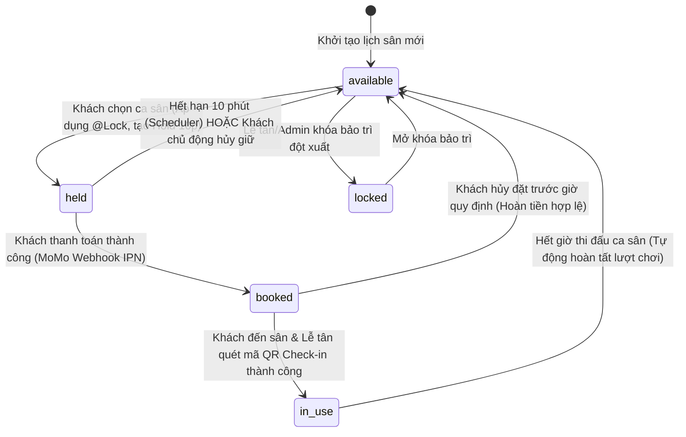
*Hình 4.3: Sơ đồ trạng thái đối tượng Ca sân (TimeSlot State Machine)*

---

### 4.3.2. Sơ đồ trạng thái đối tượng Đơn hàng hỗn hợp (Order)
Đơn hàng kết hợp phản ánh quá trình mua sắm và thanh toán đa năng:

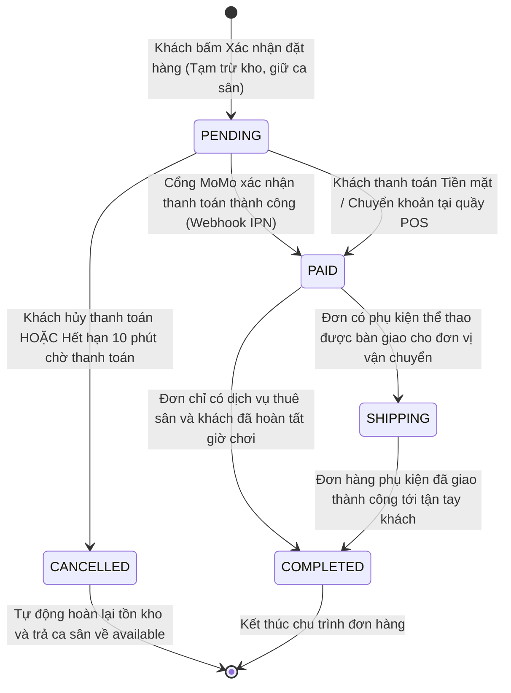
*Hình 4.4: Sơ đồ trạng thái đối tượng Đơn hàng hỗn hợp (Order State Machine)*

---

### 4.3.3. Sơ đồ trạng thái đối tượng Phiên giữ chỗ tạm thời (SlotHold)

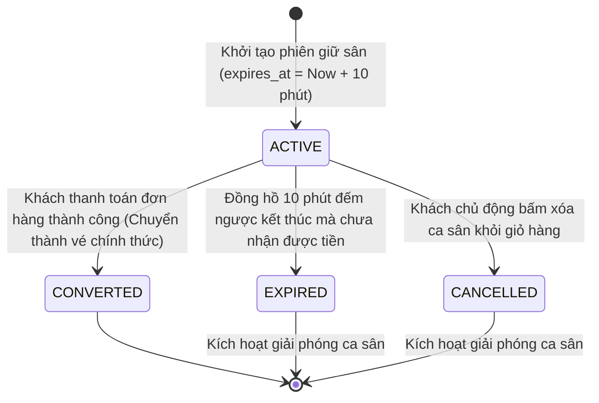
*Hình 4.5: Sơ đồ trạng thái đối tượng Phiên giữ chỗ tạm thời (SlotHold State Machine)*

---

## 4.4. Quan hệ giữa thiết kế lớp và thiết kế kiến trúc
Mô hình lớp thiết kế (Design Class Model) không đứng độc lập mà là sự cụ thể hóa chi tiết của cấu trúc kiến trúc phân tầng (Layered Architecture):

| Thành phần trong Mô hình Lớp | Vị trí trong Tầng Kiến trúc | Bảng CSDL quan hệ tương ứng | Vai trò trong dòng chảy dữ liệu |
| :--- | :--- | :--- | :--- |
| **`BookingController`, `OrderController`** | **Tầng Trình diễn / Điều khiển (Presentation / Controller)** | *Không ánh xạ CSDL* | Tiếp nhận HTTP Request từ Client SPA, kiểm tra tính hợp lệ dữ liệu và điều phối lời gọi xuống Tầng Dịch vụ. |
| **`BookingService`, `OrderService`, `ShopService`** | **Tầng Nghiệp vụ (Business Service Layer)** | *Không ánh xạ CSDL* | Quản lý ranh giới Transaction, áp dụng các giải thuật khóa bi quan `@Lock(PESSIMISTIC_WRITE)`, tính toán giảm giá, xử lý ký số MoMo. |
| **`CourtRepository`, `TimeSlotRepository`, `OrderRepository`** | **Tầng Truy xuất Dữ liệu (Repository / DAO Layer)** | *Giao tiếp trực tiếp với MySQL* | Thực thi các câu lệnh SQL tối ưu hóa, che giấu các thao tác kết nối CSDL phức tạp. |
| **`Court`, `TimeSlot`, `Order`, `ProductVariant`** | **Tầng Thực thể (Entity Domain Models)** | `courts`, `time_slots`, `orders`, `product_variants` | Lưu trữ dữ liệu thực thể nghiệp vụ, đảm bảo tính bao gói dữ liệu bên trong bộ nhớ máy chủ. |

*Bảng 4.2: Bảng ánh xạ giữa Mô hình Lớp (Class Model) và Mô hình Dữ liệu (Relational Model)*


---

\newpage

# CHƯƠNG 5. THIẾT KẾ GIAO DIỆN VÀ THÀNH PHẦN

## 5.1. Thiết kế giao diện

### 5.1.1. Nguyên tắc thiết kế giao diện
Giao diện người dùng của hệ thống PickleBallWeb được thiết kế dựa trên các nguyên lý công thái học nhận thức (Cognitive Ergonomics) và chuẩn mực thiết kế giao diện web hiện đại (Nielsen Norman Group):
1. **Tính nhất quán và đồng bộ (Consistency)**: Áp dụng hệ thống Design Token đồng nhất (Font chữ Inter, bảng màu chủ đạo Xanh thể thao Sport Blue `#0284c7`, màu cảnh báo cam `#f97316` cho phiên giữ chỗ và xanh lục `#16a34a` cho sân sẵn sàng). Các nút bấm, biểu tượng (Lucide Icons) và hộp thoại thông báo có cùng quy chuẩn hiển thị trên toàn hệ thống.
2. **Khả năng phản hồi tức thời (Immediate Feedback)**: Mọi thao tác của người dùng đều nhận được phản hồi trực quan ngay lập tức: hiệu ứng chuyển động mượt mà khi bấm chọn sân, trạng thái Loading khi gọi API và thông báo Toast nổi ở góc màn hình.
3. **Trực quan hóa trạng thái thời gian thực (Real-time Visual Metaphor)**: Thay vì hiển thị danh sách văn bản khô khan, sơ đồ sân thể thao được thiết kế dạng ma trận lưới trực quan (Grid Layout). Khách hàng dễ dàng nhận biết vị trí sân trong nhà/ngoài trời và trạng thái từng ca giờ thông qua mã màu trực quan:
   * **Màu xanh lục**: Sẵn sàng đón khách (`available`).
   * **Màu cam nhấp nháy**: Đang có người tạm giữ 10 phút (`held`).
   * **Màu đỏ thẫm**: Đã được đặt và thanh toán (`booked`).
   * **Màu tím đậm**: Khách đang thi đấu trên sân (`in_use`).
   * **Màu xám**: Đang bảo trì hoặc đóng cửa (`locked`).
4. **Tối ưu hóa thao tác tại quầy (High-speed POS Ergonomics)**: Giao diện thu ngân POS dành cho nhân viên lễ tân được thiết kế với kích thước nút bấm lớn, hỗ trợ thao tác chạm trên màn hình cảm ứng hoặc phím tắt nhanh, giúp tạo đơn và xuất bill trong vòng dưới 30 giây.

---

### 5.1.2. Người dùng và cấu trúc điều hướng (Sitemap & Navigation Flow)
Cấu trúc điều hướng được phân tách thành hai luồng trải nghiệm độc lập tương ứng với hai nhóm người dùng:

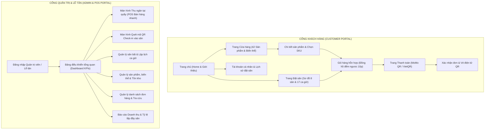
*Hình 5.1: Sơ đồ cấu trúc điều hướng người dùng (Sitemap & Navigation Flow)*

---

### 5.1.3. Thiết kế màn hình trực quan (Wireframes & UI Mockups)
Hệ thống tập trung thiết kế chuyên sâu vào 4 màn hình trọng tâm phản ánh các nghiệp vụ cốt lõi:
1. **Màn hình Đặt sân trực tuyến (Court Booking Grid Screen)**:
   * Thanh điều hướng trên cùng cho phép chọn Ngày chơi (`DatePicker`), xem thời tiết dự báo và bộ lọc sân (Tất cả, Trong nhà, Ngoài trời).
   * Khu vực trung tâm là bảng lưới gồm 8 cột (tương ứng Sân A1 $\rightarrow$ D2) và 17 hàng (tương ứng các khung giờ từ 05:00 đến 23:00). Mỗi ô hiển thị đơn giá ca sân.
   * Khi người dùng nhấp chọn ô ca sân, một hộp thoại tóm tắt hiện ra: Tên sân, Khung giờ, Đơn giá, và nút bấm "Tạm giữ sân 10 phút".
2. **Màn hình Giỏ hàng hỗn hợp (Mixed Cart Screen)**:
   * Khu vực trên cùng hiển thị thanh cảnh báo nổi bật màu cam đính kèm đồng hồ đếm ngược thời gian thực: *"Ca sân của bạn đang được giữ chỗ độc quyền trong [09:42]. Vui lòng thanh toán trước khi hết giờ!"*.
   * Danh sách giỏ hàng chia thành hai khối rõ ràng: Khối Vé đặt sân (thông tin sân, ngày, giờ) và Khối Sản phẩm phụ kiện (ảnh thu nhỏ, tên biến thể màu sắc/kích cỡ, bộ tăng giảm số lượng).
   * Khung tóm tắt thanh toán bên phải gồm: Tiền sân, Tiền phụ kiện, Ô nhập mã Voucher giảm giá, và nút chuyển tới bước thanh toán.
3. **Màn hình Thu ngân tại quầy (POS Screen)**:
   * Bố cục chia hai cột chuyên nghiệp: Cột bên trái hiển thị danh mục sản phẩm bán nhanh và ma trận sân hiện tại. Cột bên phải là hóa đơn đang tạo.
   * Hỗ trợ tìm kiếm nhanh bằng tên hoặc mã vạch, các nút chọn nhanh tiền mặt (100k, 200k, 500k), tự động tính tiền thối lại cho khách.
   * Nút bấm "Thanh toán & In hóa đơn" kích thước lớn, thao tác nhanh chóng bằng phím bấm `F9`.
4. **Màn hình Quét mã QR Check-in (QR Verification Screen)**:
   * Khung camera quét mã trực tiếp chính giữa màn hình với khung ngắm nhận diện mã QR tự động.
   * Ngay khi nhận diện mã vé từ điện thoại của khách, màn hình lập tức chuyển trạng thái hiển thị:
     * *Nếu hợp lệ*: Màn hình viền xanh lục, phát chuông "Beep" dễ chịu, hiển thị tên khách hàng, mã đơn hàng, sân số mấy và giờ chơi. Nút "Xác nhận vào sân" tự động kích hoạt chuyển ca sang `in_use`.
     * *Nếu vé giả / đã dùng*: Màn hình viền đỏ cảnh báo, phát âm thanh cảnh báo lỗi và nêu rõ lý do từ chối.

---

### 5.1.4. Thiết kế giao diện kết nối với hệ thống bên ngoài
Hệ thống thiết kế các giao diện chuẩn hóa (API Contracts) để tích hợp an toàn với các đối tác dịch vụ:
1. **Giao tiếp với Cổng thanh toán MoMo**:
   * *Giao diện khởi tạo thanh toán (`POST https://test-payment.momo.vn/v2/gateway/api/create`)*: Backend gửi thông tin đơn hàng được ký số bằng thuật toán HMAC-SHA256 (`accessKey`, `amount`, `orderId`, `orderInfo`, `redirectUrl`, `ipnUrl`). MoMo phản hồi đường link thanh toán (`payUrl`) và mã QR (`qrCodeUrl`).
   * *Giao diện tiếp nhận Webhook IPN (`POST /api/v1/webhooks/payment/momo`)*: MoMo bắn dữ liệu kết quả giao dịch về máy chủ Backend. Backend kiểm tra tính hợp lệ của trường `signature` trước khi tiến hành cập nhật CSDL.
2. **Giao tiếp với Thư viện tạo và quét mã QR (ZXing Engine)**:
   * *Sinh mã QR vé điện tử*: Khi đơn hàng chuyển sang `PAID`, hệ thống gọi thư viện `com.google.zxing` để sinh mã QR Base64 mã hóa chuỗi payload có cấu trúc: `PICKLE|{orderCode}|{slotId}|{timestamp}|{hmacSignature}`.
   * *Xác thực vé*: Khi Lễ tân quét mã, Backend giải mã chuỗi token, kiểm tra chữ ký xác thực chống sửa đổi vé, đối soát CSDL và chuyển trạng thái vé sang `CHECKED_IN`.

---

## 5.2. Thiết kế thành phần

### 5.2.1. Interface của các thành phần (Component Interfaces)

| Tên Interface thành phần | Phương thức khai báo chính | Tham số đầu vào | Kết quả trả về | Mô tả mục đích nghiệp vụ |
| :--- | :--- | :--- | :--- | :--- |
| **`IBookingService`** | `holdSlotWithLock` | `slotId: Long`, `userId: Long` | `SlotHoldDTO` | Kích hoạt khóa bi quan `@Lock(PESSIMISTIC_WRITE)`, tạo phiên giữ chỗ 10 phút. |
| | `releaseHold` | `holdId: Long` | `boolean` | Giải phóng ca sân về trạng thái sẵn sàng. |
| | `checkInSlot` | `slotId: Long` | `TimeSlotDTO` | Chuyển trạng thái ca sân sang `in_use`. |
| **`IShopService`** | `deductStock` | `variantId: Long`, `qty: int` | `void` | Kiểm tra tồn kho và khấu trừ số lượng sản phẩm. |
| | `revertStock` | `variantId: Long`, `qty: int` | `void` | Hoàn trả số lượng tồn kho khi đơn hàng bị hủy. |
| **`IOrderService`** | `processCheckout` | `request: CheckoutRequestDTO` | `OrderResponseDTO` | Điều phối giao dịch nguyên tử giỏ hàng hỗn hợp. |
| | `completeOrder` | `orderCode: String` | `void` | Xác nhận đơn hàng đã thanh toán thành công. |
| **`IPaymentGateway`** | `createPayment` | `order: Order` | `PaymentInitResult` | Sinh liên kết thanh toán và mã QR từ MoMo. |
| | `verifyWebhook` | `payload: WebhookDTO` | `boolean` | Xác thực tính hợp lệ chữ ký số HMAC-SHA256. |

*Bảng 5.1: Danh mục Interface của các thành phần nghiệp vụ cốt lõi*

---

### 5.2.2. Sơ đồ thành phần (Component Diagram)

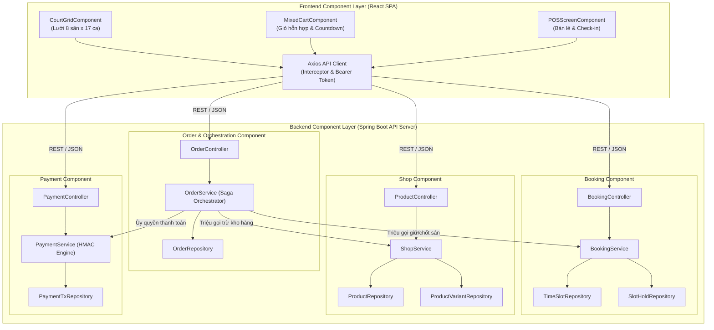
*Hình 5.2: Sơ đồ thành phần hệ thống (Component Diagram)*

---

### 5.2.3. Thiết kế tương tác giữa các thành phần (Sequence Diagrams)

#### a) Sơ đồ tuần tự: Nghiệp vụ Khóa giữ chỗ 10 phút chống tranh chấp đồng thời
Sơ đồ mô tả kịch bản hai khách hàng $U_1$ và $U_2$ cùng gửi yêu cầu giữ một ca sân tại cùng một thời điểm:

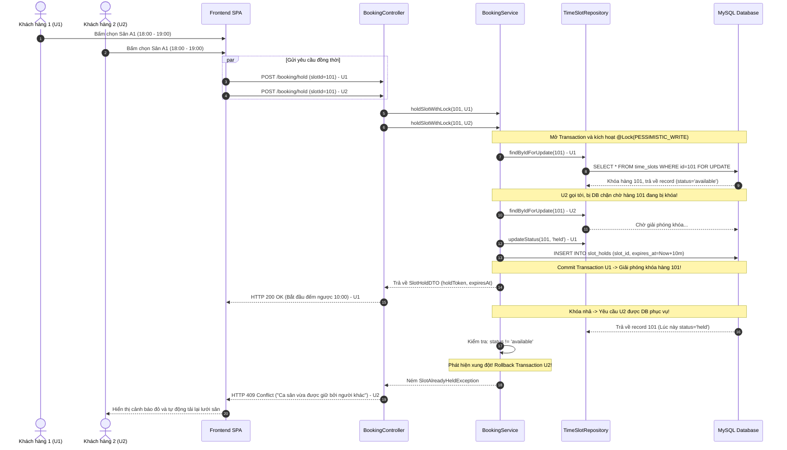
*Hình 5.3: Sơ đồ tuần tự - Nghiệp vụ Khóa giữ chỗ 10 phút chống tranh chấp*

---

#### b) Sơ đồ tuần tự: Nghiệp vụ Thanh toán đơn hàng kết hợp nguyên tử (Atomic Saga)

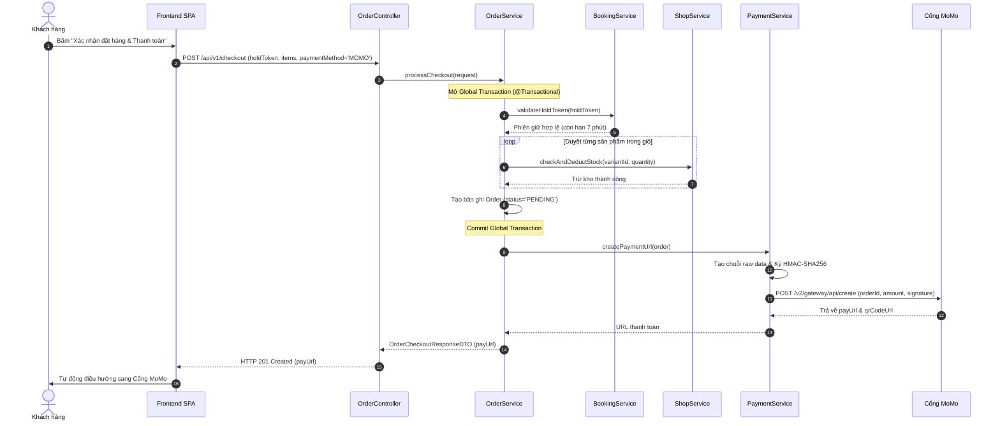
*Hình 5.4: Sơ đồ tuần tự - Nghiệp vụ Thanh toán đơn hàng kết hợp nguyên tử*

---

#### c) Sơ đồ tuần tự: Tiếp nhận và xác thực Webhook MoMo IPN chữ ký số HMAC

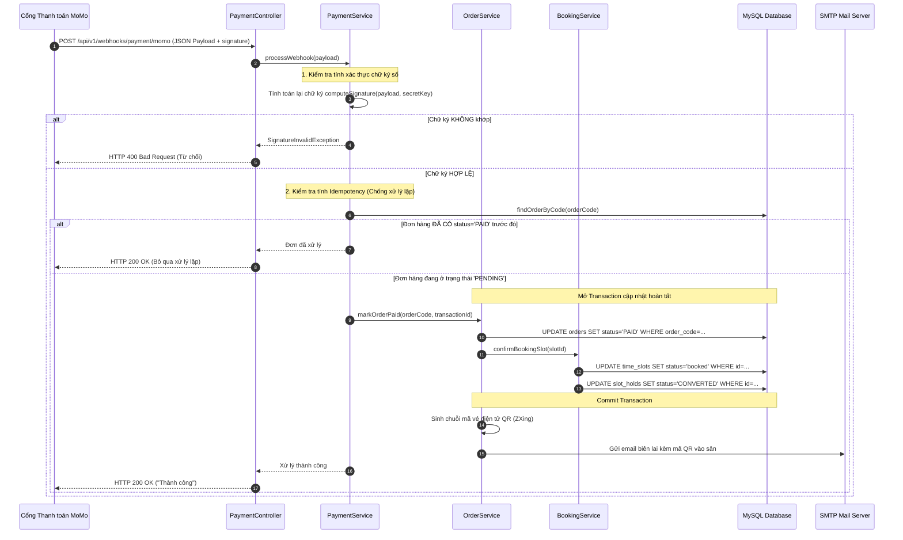
*Hình 5.5: Sơ đồ tuần tự - Tiếp nhận và xác thực Webhook MoMo IPN chữ ký số HMAC*

---

### 5.2.4. Thiết kế chi tiết các thành phần trọng tâm
1. **Thành phần Khóa bi quan và Lập lịch giữ chỗ (`BookingEngine`)**:
   * Áp dụng Annotation `@Lock(LockModeType.PESSIMISTIC_WRITE)` của Spring Data JPA trên phương thức `findWithLockById`.
   * Tác vụ quét dọn tự động chạy ngầm:
     ```java
     @Scheduled(fixedRate = 15000) // Quét định kỳ mỗi 15 giây
     @Transactional
     public void releaseExpiredHolds() {
         List<SlotHold> expiredHolds = holdRepository.findAllExpired(LocalDateTime.now(), HoldStatus.ACTIVE);
         for (SlotHold hold : expiredHolds) {
             hold.setStatus(HoldStatus.EXPIRED);
             TimeSlot slot = hold.getTimeSlot();
             if (slot.getStatus() == SlotStatus.HELD) {
                 slot.setStatus(SlotStatus.AVAILABLE);
             }
         }
     }
     ```
2. **Thành phần Bảo mật Webhook MoMo (`PaymentEngine`)**:
   * Xây dựng giải thuật sinh chữ ký HMAC-SHA256 theo đúng tiêu chuẩn công nghiệp:
     $$\text{Signature} = \text{HMAC-SHA256}\Big(\text{RawData},\; \text{SecretKey}\Big)$$
   * Chuỗi dữ liệu thô (`RawData`) được ghép nối theo thứ tự bảng chữ cái nghiêm ngặt: `accessKey=...&amount=...&extraData=...&message=...&orderId=...&orderInfo=...&orderType=...&partnerCode=...&payType=...&requestId=...&responseTime=...&resultCode=...&transId=...`.

---

### 5.2.5. Đánh giá theo tính gắn kết (Cohesion) và tính ghép nối (Coupling)

| Thành phần phần mềm | Mức độ Gắn kết (Cohesion) | Mức độ Ghép nối (Coupling) | Đánh giá kiến trúc chi tiết |
| :--- | :---: | :---: | :--- |
| **`BookingService`** | **Functional Cohesion (Rất cao)** | **Loose Coupling (Rất thấp)** | Chỉ chuyên trách duy nhất việc quản lý trạng thái sân và cơ chế giữ chỗ 10 phút. Hoàn toàn không biết đến sự tồn tại của giỏ hàng hay phương thức thanh toán. |
| **`ShopService`** | **Functional Cohesion (Rất cao)** | **Loose Coupling (Rất thấp)** | Chỉ tập trung vào việc quản lý sản phẩm, biến thể SKU và số lượng tồn kho. Độc lập hoàn toàn với lịch sân. |
| **`PaymentService`** | **Functional Cohesion (Rất cao)** | **Loose Coupling (Rất thấp)** | Chỉ chuyên sâu vào việc mã hóa dữ liệu, ký số HMAC và tiếp nhận Webhook từ MoMo. Không can thiệp vào cách thức CSDL cập nhật đơn hàng. |
| **`OrderService`** | **Sequential Cohesion (Cao)** | **Medium Coupling (Trung bình)** | Đóng vai trò thành phần điều phối (Orchestrator). Có mức ghép nối trung bình do phải gọi tới `BookingService`, `ShopService` và `PaymentService`, nhưng tương tác hoàn toàn qua các Interface trừu tượng và DTO, đảm bảo nguyên lý Đảo ngược phụ thuộc (DIP). |

*Bảng 5.2: Bảng đánh giá mức độ Gắn kết (Cohesion) và Ghép nối (Coupling) của các thành phần*


---

\newpage

# KẾT LUẬN VÀ KIẾN NGHỊ

### 1. Kết luận

#### 1.1. Kết quả đạt được
Sau quá trình nghiên cứu lý thuyết chuyên sâu và vận dụng bài bản phương pháp luận kỹ nghệ phần mềm vào đề tài **"Phân tích và thiết kế hệ thống quản lý, đặt sân thể thao Pickleball và bán thiết bị trực tuyến theo hướng đối tượng và kiến trúc phân tầng (OOAD & Layered Architecture)"**, nhóm nghiên cứu đã hoàn thành toàn diện các mục tiêu đề ra với những kết quả cụ thể:
1. **Hoàn thiện bản phân tích yêu cầu nghiệp vụ chuẩn mực**:
   * Khảo sát thấu đáo quy trình vận hành thực tế tại các cụm sân Pickleball, xác định chính xác các tác nhân và xây dựng danh mục 12 yêu cầu chức năng (FR01 – FR12) cùng 8 yêu cầu phi chức năng (NFR01 – NFR08) theo chuẩn chất lượng ISO/IEC 25010.
   * Xây dựng hệ thống sơ đồ Use Case phân cấp (Tổng thể, Phân hệ Khách hàng, Phân hệ Quản trị & POS) và lập bảng đặc tả chi tiết cho 4 Use Case trọng tâm có độ phức tạp cao nhất.
   * Mô hình hóa trực quan các quy trình nghiệp vụ then chốt (Quy trình giữ chỗ 10 phút, Thanh toán giỏ hàng hỗn hợp, Thu ngân tại quầy và Quét mã QR check-in) bằng các Sơ đồ Hoạt động (Activity Diagrams) tường minh.
2. **Thiết lập kiến trúc phần mềm hiện đại, tối ưu và có cơ sở khoa học**:
   * Phân tích, so sánh các phương án kiến trúc và lựa chọn mô hình **Kiến trúc Phân tầng (Layered Architecture) kết hợp Khách - Chủ tách rời (Headless Decoupled RESTful API & Dual React SPA)**.
   * Phân rã hệ thống thành 6 phân hệ chuyên trách, đảm bảo tính gắn kết cao (High Cohesion) và ghép nối lỏng (Loose Coupling).
   * Vận dụng thành công phương pháp ATAM của Viện SEI để đánh giá kiến trúc thông qua 4 kịch bản chất lượng, chứng minh kiến trúc có khả năng chịu tải tốt và loại trừ triệt để lỗi tranh chấp đồng thời ca sân.
3. **Mô hình hóa dữ liệu và hướng đối tượng chi tiết, chặt chẽ**:
   * Thiết kế cơ sở dữ liệu quan hệ đạt chuẩn Dạng chuẩn 3 (3NF) với 10 thực thể cốt lõi, bảo đảm toàn vẹn tham chiếu và hỗ trợ giỏ hàng hỗn hợp thông qua phân loại mục hàng (`item_type`).
   * Xây dựng Sơ đồ Lớp chi tiết (Class Diagram) theo mẫu phân loại Boundary - Control - Entity (BCE) và Service Layer, áp dụng triệt để 5 nguyên lý SOLID và các mẫu thiết kế GoF (Repository, DTO, Strategy, Pessimistic Locking).
   * Mô hình hóa vòng đời chuyển đổi trạng thái của các thực thể nhạy cảm (`TimeSlot`, `Order`, `SlotHold`) bằng Sơ đồ máy trạng thái (State Machine Diagrams).
4. **Thiết kế thành phần và giao diện công thái học**:
   * Thiết kế cấu trúc điều hướng (Sitemap), bố cục giao diện trực quan hóa ma trận sân theo mã màu thời gian thực và đồng hồ đếm ngược 10 phút giữ chỗ.
   * Xây dựng các Sơ đồ Tuần tự (Sequence Diagrams) mô tả chính xác tương tác thông điệp giữa các đối tượng để giải quyết triệt để các bài toán kỹ thuật phức tạp: Khóa bi quan `@Lock(PESSIMISTIC_WRITE)`, Giao dịch nguyên tử giỏ hàng hỗn hợp, Tiếp nhận Webhook MoMo IPN chữ ký số HMAC-SHA256 và Xác thực vé điện tử bằng thư viện ZXing.

#### 1.2. Hạn chế của đề tài
Bên cạnh những kết quả tích cực đã đạt được, bản thiết kế của đề tài vẫn còn tồn tại một số hạn chế nhất định do giới hạn về mặt thời gian và phạm vi nghiên cứu:
* **Chưa tích hợp cơ chế xếp hàng phân tán (Message Queue)**: Hiện tại cơ chế giải phóng ca sân hết hạn vẫn dựa trên bộ lập lịch nền (`@Scheduled`) quét cơ sở dữ liệu định kỳ mỗi 15 giây. Trong các đợt mở bán giải đấu quy mô lớn với hàng chục ngàn người truy cập cùng lúc, giải pháp này có thể gây áp lực truy vấn lên CSDL. Việc áp dụng hàng đợi trễ (Delay Queue) trên Redis hoặc RabbitMQ sẽ tối ưu hơn.
* **Chưa hỗ trợ linh hoạt ca sân có thời lượng lẻ**: Hệ thống hiện tại đang quy hoạch các ca sân theo các block cố định 60 phút (17 ca/ngày). Chưa hỗ trợ người chơi đặt các khung giờ lẻ (ví dụ: đặt 90 phút hoặc 120 phút liên tục mà không bị gián đoạn giữa các block).
* **Phạm vi thanh toán**: Đề tài mới chỉ thiết kế và tích hợp hoàn chỉnh với Cổng thanh toán MoMo và VietQR; chưa mở rộng sang các cổng quốc tế (Visa/Mastercard qua Stripe) phục vụ cho vận động viên người nước ngoài.

---

### 2. Kiến nghị

Từ những kết quả thu được trong quá trình thực hiện bài tập lớn, nhóm nghiên cứu xin đề xuất một số kiến nghị:
1. **Về phía đào tạo học phần**: Đề tài cho thấy sự kết hợp giữa lý thuyết Kỹ nghệ phần mềm (OOAD, UML, Architectural Styles, ATAM) với một bài toán nghiệp vụ hiện đại có tính thời sự (như quản lý sân thể thao và thương mại kết hợp) mang lại hiệu quả tiếp thu tri thức rất cao. Nhóm kiến nghị Nhà trường và Bộ môn tiếp tục duy trì định hướng thực hành phân tích sâu vào các bài toán thực tiễn có tính chất xử lý đồng thời (Concurrency) và giao dịch phân tán.
2. **Về phía ứng dụng thực tiễn**: Các cụm sân thể thao hiện nay nên mạnh dạn từ bỏ phương thức ghi chép sổ sách thủ công hoặc Google Sheets để chuyển đổi sang mô hình ứng dụng web tự động hóa có cơ chế giữ chỗ độc quyền theo thời gian thực, giúp giảm thiểu 100% tình trạng trùng lịch và tối đa hóa hiệu suất khai thác sân bãi.

---

### 3. Hướng phát triển

Nhằm hoàn thiện và nâng tầm hệ thống trong tương lai, nhóm nghiên cứu định hướng các bước phát triển tiếp theo:
1. **Nâng cấp kiến trúc với Redis Caching và Event-Driven Architecture**:
   * Đưa hệ thống bộ nhớ đệm Redis vào lưu trữ trạng thái các ca sân trống (`TimeSlot Cache`) để giảm tải 80% truy vấn đọc vào MySQL.
   * Áp dụng tính năng Redis Keyspace Notifications (hết hạn Key TTL sau 600 giây) để bắn sự kiện giải phóng ca sân tự động tức thời mà không cần chạy job quét CSDL.
2. **Phát triển ứng dụng di động đa nền tảng (React Native / Flutter)**:
   * Tận dụng tối đa ưu thế của tầng Backend Headless RESTful API đã được thiết kế chuẩn mực để xây dựng thêm ứng dụng di động cho vận động viên. Tích hợp tính năng thông báo đẩy (Push Notification) nhắc nhở giờ thi đấu trước 60 phút và định vị GPS dẫn đường tới cụm sân.
3. **Ứng dụng Trí tuệ nhân tạo (AI) trong Định giá động và Dự báo**:
   * Xây dựng mô-đun định giá linh hoạt (Dynamic Pricing): tự động điều chỉnh giá ca sân dựa trên phân tích dữ liệu lịch sử, thời tiết (nắng/mưa) và nhu cầu đặt sân thực tế theo từng mùa giải.
   * Tích hợp thuật toán gợi ý ghép trận (Matchmaking Algorithm) giúp những người chơi đi một mình có thể tìm kiếm bạn chơi có trình độ DUPR (Dynamic Universal Pickleball Rating) tương đương tại cùng cụm sân.

---

\newpage

# TÀI LIỆU THAM KHẢO

### I. Giáo trình và Sách chuyên khảo tiếng Việt
1. **Đặng Văn Đức** (2008), *Phân tích và thiết kế hướng đối tượng bằng UML*, Nhà xuất bản Khoa học và Kỹ thuật, Hà Nội.
2. **Đoàn Văn Ban** (2007), *Giáo trình Kỹ nghệ phần mềm*, Nhà xuất bản Đại học Quốc gia Hà Nội.
3. **Nguyễn Văn Vỵ** (2012), *Giáo trình Phân tích và thiết kế hệ thống thông tin quản lý*, Nhà xuất bản Tài chính, Hà Nội.

### II. Sách chuyên khảo và Tài liệu học thuật tiếng Anh
4. **Bass, L., Clements, P., & Kazman, R.** (2021), *Software Architecture in Practice* (4th Edition), Addison-Wesley Professional / SEI Series in Software Engineering.
5. **Clements, P., Kazman, R., & Klein, M.** (2002), *Evaluating Software Architectures: Methods and Case Studies (The ATAM Method)*, Addison-Wesley Professional.
6. **Fowler, M.** (2002), *Patterns of Enterprise Application Architecture*, Addison-Wesley Longman Publishing Co., Inc.
7. **Gamma, E., Helm, R., Johnson, R., & Vlissides, J.** (1994), *Design Patterns: Elements of Reusable Object-Oriented Software (GoF)*, Addison-Wesley Professional.
8. **Martin, R. C.** (2017), *Clean Architecture: A Craftsman's Guide to Software Structure and Design*, Prentice Hall.
9. **Pressman, R. S., & Maxim, B. R.** (2020), *Software Engineering: A Practitioner's Approach* (9th Edition), McGraw-Hill Education.
10. **Sommerville, I.** (2015), *Software Engineering* (10th Edition), Pearson Education.

### III. Tiêu chuẩn quốc tế và Tài liệu kỹ thuật chuyên ngành
11. **ISO/IEC 25010:2011**, *Systems and software engineering — Systems and software Quality Requirements and Evaluation (SQuaRE) — System and software quality models*, International Organization for Standardization.
12. **Object Management Group (OMG)** (2017), *OMG Unified Modeling Language (OMG UML) Specification, Version 2.5.1*, Standard Document formal/2017-12-05.
13. **MoMo Developers Documentation** (2025), *Payment Gateway Integration API Specifications & HMAC-SHA256 Verification Guide*, Cổng thanh toán trực tuyến MoMo.
14. **Spring Framework Reference Documentation** (2024), *Transaction Management and Data Access with Spring Data JPA & Hibernate Pessimistic Locking*, VMware Tanzu.
