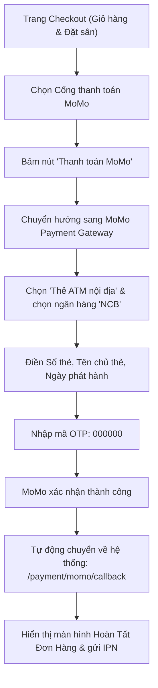

# Hướng Dẫn & Thông Tin Thanh Toán Thử Nghiệm MoMo Sandbox

Tài liệu này tổng hợp toàn bộ thông tin tài khoản, thẻ ngân hàng và các bước nhập liệu khi thực hiện thử nghiệm thanh toán đơn hàng qua **Cổng thanh toán MoMo Sandbox** trên hệ thống DemoPick Pickleball.

---

## 1. Thông Tin Thẻ ATM Nội Địa Napas (Khuyên Dùng Để Test)

Khi chọn thanh toán qua **Thẻ ATM nội địa** trên cổng MoMo Sandbox, quý khách/tester nhập các thông tin sau:

| Thông tin | Giá trị nhập | Ghi chú |
| :--- | :--- | :--- |
| **Ngân hàng phát hành** | **NCB** (Ngân hàng Quốc Dân) | Chọn logo ngân hàng NCB trong danh sách |
| **Số thẻ ATM** | `9704198526191432198` | Có thể nhập dạng có khoảng trắng: `9704 1985 2619 1432 198` |
| **Tên chủ thẻ** | `NGUYEN VAN A` | Nhập viết hoa không dấu |
| **Ngày phát hành (Tháng/Năm)** | `07/15` | Tháng 07 năm 2015 |
| **Mã OTP xác thực** | `000000` | Gồm 6 số 0 |

---

## 2. Thông Tin Tài Khoản Ứng Dụng Ví MoMo Sandbox (Quét Mã QR)

Nếu sử dụng ứng dụng MoMo phiên bản Test/Sandbox trên điện thoại để quét mã QR:

| Thông tin | Giá trị nhập |
| :--- | :--- |
| **Số điện thoại ví MoMo** | `0963000000` hoặc tài khoản test được cấp |
| **Mật khẩu đăng nhập ví** | `000000` |
| **Mã OTP xác nhận** | `000000` |

---

## 3. Quy Trình Các Bước Thực Hiện Thanh Toán

### Các bước cụ thể:
1. **Bước 1**: Tại màn hình **Thanh toán (Checkout)**, sau khi điền thông tin người nhận hàng và địa chỉ giao hàng, tại mục **Phương Thức Thanh Toán Bảo Mật**, chọn:
   * **Cổng thanh toán MoMo**
2. **Bước 2**: Bấm nút **"Thanh toán MoMo"** ở cột tóm tắt đơn hàng bên phải.
3. **Bước 3**: Trình duyệt chuyển hướng đến cổng **Hosted Payment Page của MoMo**.
4. **Bước 4**: 
   * Chọn phương thức **Thẻ ATM / Tài khoản ngân hàng**.
   * Bấm chọn biểu tượng ngân hàng **NCB**.
   * Nhập:
     - Số thẻ: `9704198526191432198`
     - Tên chủ thẻ: `NGUYEN VAN A`
     - Ngày phát hành: `07/15`
   * Bấm **Tiếp tục / Thanh toán**.
5. **Bước 5**: Tại màn hình nhập mã xác thực OTP gửi về SMS, nhập **`000000`** và bấm **Xác nhận**.
6. **Bước 6**: MoMo xử lý và tự động chuyển hướng khách hàng về lại trang kết quả trên DemoPick (`/payment/momo/callback`), cập nhật trạng thái đơn hàng sang **ĐÃ THANH TOÁN (PAID)**.
